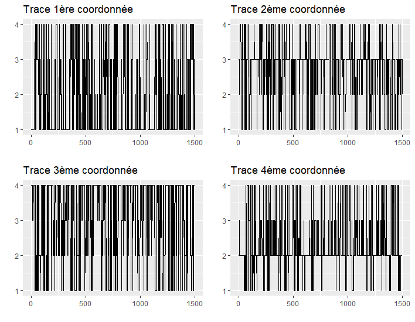
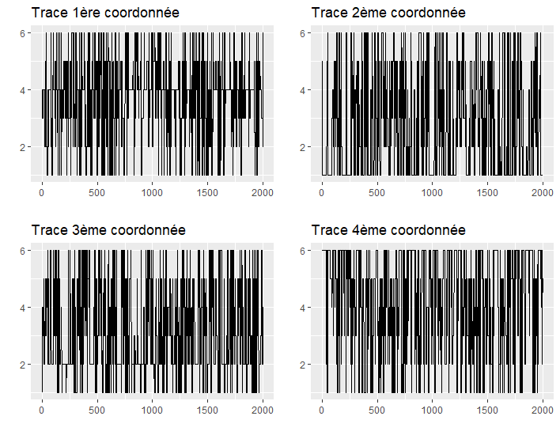
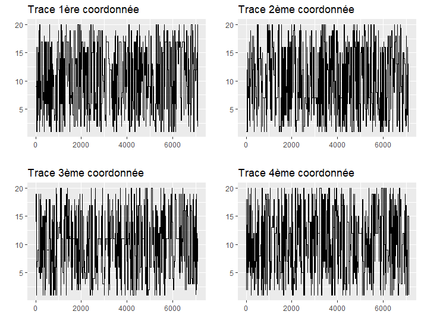
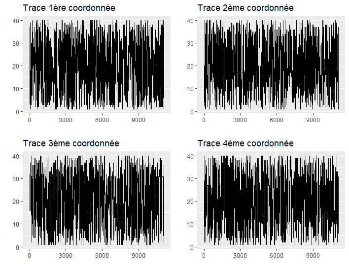
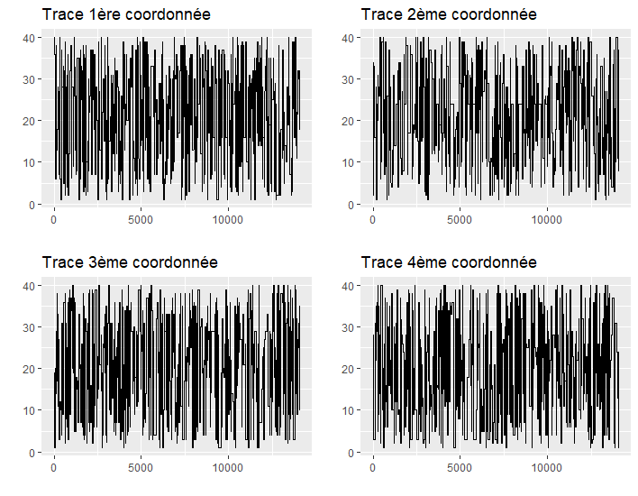

```{r setup, include=FALSE}
knitr::opts_chunk$set(echo = TRUE,
                      cache = TRUE)
```


```{r, include=FALSE}
set.seed(1)
```

L'algorithme de Metropolis-Hastings requiert une initialisation à une valeur $X_0$. Cette valeur, choisie au hasard, ne correspond pas à un réel état qui aurait été simulé selon la loi $\pi$ qui nous intéresse. En réalité, cela va être le cas de toutes les premières valeurs, le temps que l'algorithme converge. Il faut donc pouvoir déterminer à partir de quel moment on peut considérer que l'obtient bien des états issus de la loi $\pi$, c'est ce qu'on appelle le *burn-in*.

Dans notre cas, l'idée est d'estimer ce *burn-in* pour des valeurs de $n$ et $m$ différentes. En effet, on peut supposer que plus $n$ et/ou $m$ vont être grands, plus le temps que va mettre l'algorithme de Metropolis-Hastings à converger est long. C'est ce que nous allons essayons de mesurer en s'intéressant à la trace. La trace est en fait le graphique représentant l'évolution d'une valeur au cours des différents états générés par l'algorithme de Metropolis-Hastings.

Dans notre cas, chaque état correspond à une permutation, qu'il n'est pas facile de représenter, encore moins son évolution dans le temps. Nous allons donc représenter les 4 premières coordonnées de ces permutations, afin de mesurer le *burn-in* dans les différents cas et d'estimer une valeur grossière. L'idée est de regarder à partir de quand la valeur de la coordonnée semble suivre un comportement aléatoire.

# Avec n = 4 et m = 4

```{r, fig.width=4}

```

Quand $n$ et $m$ sont petits, il est inévitable qu'une coordonnée puisse garder la même valeur pendant plusieurs itérations, mais nous cherchons l'état à partir duquel ces *plateaux* ne sont plus très grands et à partir duquel les valeurs prises par la coordonnée balaye tout l'espace. Nous remarquons que cela semble être le cas à partir de 1 000 pour la 2ème coordonnée et que cette valeur dépasse également le *burn-in* des autres coordonnées.

# Avec n = 4 et m = 6

```{r, fig.width=4}

```

Quand $m$ passe à 6, le *burn-in* semble légèrement augmenter par rapport au cas précédent, avec l'apparition d'un plateau après 1000 pour la quatrième coordonnée, nous pourrions donc plutôt envisager un *burn-in* de 1 500 dans ce cas.

# Avec n = 10 et m = 20

```{r, fig.width=4}
knitr::include_graphics("img/n_10_m_20.png")
```

Pour $m = 20$, on remarque sur la trace de la première coordonnée un long moment entre 3 000 et 4 000 où l'on ne semble plus atteindre des valeurs au-dessus de 4 et un autre moment autour de 5 000 où les valeurs faibles ne sont pas atteintes, on peut donc conseiller un *burn-in* de 5 000 ici.

# Avec n = 20 et m = 20

```{r, fig.width=4}

```

L'augmentation de $n$ par rapport au cas précédent a modifié légèrement les traces mais le *burn-in* de 5 000 reste toujours acceptable.

# Avec n = 10 et m = 40

```{r, fig.width=4}

```

Une nouvelle augmentation de $m$ à 50 allonge de nouveau le *burn-in*. En effet, on remarque que l'ensemble est valeurs est parcouru à partir de l'itération 7 500 environ (notamment sur la deuxième coordonnée), on peut donc prendre cette valeur comme burn-in.

# Avec n = 40 et m = 40

```{r, fig.width=4}

```

L'augmentation de $n$ semble cette fois-ci avoir un peu modifié les traces, notamment pour la 2ème coordonnée, on a plutôt envie d'estimer le *burn-in* aux alentours de 10 000.

# Conclusions

On remarque qu'il y a bien des différences sur la trace et donc sur la valeur du *burn-in* selon la valeur de $n$ et $m$. Plus elles sont grandes, plus le *burn-in* est important. La valeur de $m$ semble être plus discriminante que celle de $n$, même si l'impact de cette dernière n'est pas nulle. Si on se restreint aux cas où $n = m$, on peut estimer le *burn-in* à environ $250 \times m$.