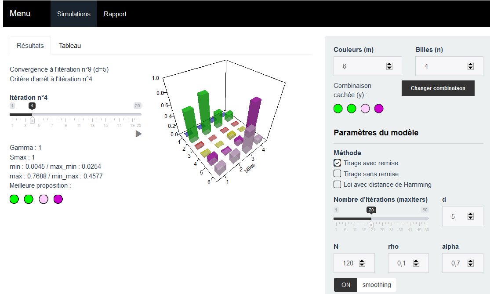

```{r setup, include=FALSE}
knitr::opts_chunk$set(echo = TRUE,
                      cache = FALSE)
library(knitr)
library(kableExtra)
library(clue)
library(mvtnorm)
library(plot3D)
library(portes)
library(shiny)
library(shinyjs)
library(shinyWidgets)
```

```{r firstProg, echo=FALSE}
# source("../ShinyApp/global.R", encoding="UTF-8",chdir = TRUE)
set.seed(1)
options(knitr.kable.NA = ' ')
creation_tableau <- function(tab, titre = "", note_debut = NULL, note_fin = NULL, nb_simuls = "5 x n x m"){
  tableau <- tab %>%
  #cbind(" " = "n", "  " = rownames(.), .)
  cbind("n / m " = rownames(.), .) #NEW
  rownames(tableau) <- NULL
  note <- c("Statistiques sur 10 seeds",
            sprintf("N = %s simulations", nb_simuls),
            "Au maximum 100 itérations")
  note <- c(note_debut, note, note_fin)
  tableau %>% 
    kable(#caption = titre,
                   format.args = list(decimal.mark = ",")) %>%
    #kable_styling(full_width = F)%>%
    column_spec(1, bold = T) %>% 
    row_spec(row=0, bold = T) #%>% 
    #collapse_rows(columns = 1, valign = "middle") #%>% 
    #add_header_above(c(" " = 2, "m" = 7)) %>% 
    #footnote(general = note, general_title = "Note : ",threeparttable = TRUE)
}
```

# Introduction

### Introduction

- **code** : $n$ boules de couleur parmi $m$ couleurs possibles  
(classiquement $n = 4$ et $m = 6$)  
- **boules noires** : boules bien placées
- **boules blanches** : boules de la bonne couleur, mais mal placées 


\begin{figure}
\begin{tikzpicture}
\draw[color=black,decorate,decoration={brace}] (2,2) -- (3,2) node[above=0.2cm,pos=0.5] {Joueur 1};
\draw[color=black,decorate,decoration={brace}] (3,2) -- (10,2) node[above=0.2cm,pos=0.5] {Joueur 2};
\end{tikzpicture}

\includegraphics[width=0.7\textwidth]{img/mastermind.png}
\captionsetup{margin=0cm,format=hang,justification=justified}
\end{figure}

$\longrightarrow$ Résolution par *Cross-Entropy*

## Rappels sur la méthode de *Cross-Entropy*
### Objectif de la *Cross-Entropy*

Résoudre \dots 
\begin{equation} 
S(x^{*})=\gamma^{*}=\underset{x\in\mathcal{X}}{{\max}} S(x)
\end{equation} 

\dots \  en lui associant un problème stochastique :
\begin{itemize}
\item $1_{\left\{ S(x)\geq\gamma\right\}}$ sur $\mathcal{X}$ pour plusieurs seuils $\gamma\in\mathbb{R}$ ;  
\item $\{f(\cdot;v),\,v\in\mathcal{V}\}$ famille de probabilités sur $\mathcal{X}$, paramétrée par $v$. 
\end{itemize}

### Algorithme \bcoutil

\begin{enumerate}

\item<1-> \textbf{Initialisation :} on fixe  $\hat{v}_{0}$, $N\in \mathbb N$ et $\rho\in]0,1[$, $t = 1$.  
\item<2-> On génère $X_{1},\dots,X_{N} \quad  {\sim} \quad f(\cdot,v_{t-1})$, on calcule 
$$\hat{\gamma}_{t}=S_{\lceil(1-\rho)N\rceil}$$

\item<3-> On utilise le même échantillon $X_{1},\dots,X_{N}$ pour trouver $\hat{v}_{t}$ :
\begin{equation}
\hat{v}_{t}=\underset{v}{argmax}\;\hat{D}(v)=\underset{v}{argmax}\frac{1}{N}\sum_{i=1}^{N}1_{\{S(X_{i})\geq\hat{\gamma}_{t}\}}\ln f(X_{i};v)
\end{equation}
\item<5->  \emph{[FACULTATIF] smoothed updating} (éviter l'occurence de 0 et de 1) :
$$
\hat{v}_{t}=\alpha\tilde{v}_{t}+(1-\alpha)\hat{v}_{t-1}
$$
\item<4-> \textbf{Arrêt} : si pour un certain $t\geq d$,  on a : 
$$\hat{\gamma}_{t}=\hat{\gamma}_{t-1}=\dots=\hat{\gamma}_{t-d}$$
\end{enumerate}

# Application de la méthode de *Cross-Entropy* au Mastermind (Q1) {#sec:q1}

### Question 1 \bccrayon

Mettre en oeuvre un algorithme basé sur la méthode CE en détaillant :

\begin{enumerate}
\item la fonction score choisie;
\item la famille paramétrique choisie (pour simuler des codes);
\item la méthode pour simuler une loi de cette famille;
\item la méthode utilisée pour estimer le paramètre \og optimal \fg{} à chaque étape.
\end{enumerate}


## Paramètres utilisés

### Paramètres utilisés


\begin{itemize}

\item<1-> $\mathcal{X}=\left\{ 1,2,\dots,m\right\}^{n}$  

\item<2-> Famille paramétrique : $$\mathcal{V} = \left\{ \left(p_{i,j}\right)_{i,j} \in\mathcal{M}_{n,m}([0,1])\::\:\forall i,\sum_{j=1}^mp_{i,j}=1\right\} $$
\textbf{Remarque} : $X=(X_{1},\dots,X_{n})\in\mathcal{X}$ tirées aléatoirement selon $p_{1},\dots,p_{n}$, la $j$ \ieme{} composante de $p_{i}$ étant égale à $p_{ij}=\mathbb{P}(X_{i}=j)$ : probabilité d'avoir une boule de couleur $j$ en $i$ème position.

\item<3-> Score : 
$$
S(x)=\frac{\omega_{noir}\times N_{\text{boules noires}}+\omega_{blanc}\times N_{\text{boules blanches}}
}{
\omega_{noir}\times n
}
$$
avec, par exemple, $\omega_{noir}=2$ et $\omega_{blanc}=1$.


\end{itemize}


## Algorithme de *Cross-Entropy* 

### Algorithme de *Cross-Entropy*

\begin{enumerate}


\item Initialisation 

\begin{itemize}
\item 
\highlight{$\hat{v}_{0} = \left(\frac{1}{m}\right)_{i=1..n,j=1..m}$} (probabilités uniformes pour chaque couleur)
\item \highlight{$N = C\times m \times n $} ($C=5$ par défaut)
\item \highlight{$\rho = 0,1$} (maximisation réalisée sur les 10 \% meilleurs échantillons)

\end{itemize}
 
\item $X_{1},\dots,X_{N} \quad  {\sim} \quad f(\cdot,v_{t-1})$, 
$\hat{\gamma}_{t}=S_{\lceil(1-\rho)N\rceil}$

\item Trouver $\hat{v}_{t}$, qui correspond ici à la matrice de terme  :
\highlight{\begin{equation}
p_{k,l}=\frac{\sum_{i=1}^{N}1_{\{S(X_{i})\geq\hat{\gamma}_{t}\}}1_{\left\{ X_{i,k}=l\right\} }}{\sum_{i=1}^{N}1_{\{S(X_{i})\geq\hat{\gamma}_{t}\}}}
\end{equation}}

\item \emph{[FACULTATIF] smoothed updating}

\item Arrêt : si pour un certain $t\geq d$ (\highlight{$d = 5$}), on a : 
$\hat{\gamma}_{t}=\dots=\hat{\gamma}_{t-d}$

\end{enumerate}


## Résultats

### Premiers résultats

[Application web interactive](https://antuki.shinyapps.io/mastermind)

[](https://antuki.shinyapps.io/mastermind)

### Résultats sur de nombreuses simulations

\tiny
\begin{figure}
\begin{minipage}{.4\textwidth}
\normalsize{Itération médiane

de convergence}
\end{minipage}%
\begin{minipage}{.6\textwidth}
```{r tabq1convmed, echo=FALSE}
#titre = "Itération médiane de convergence
stats <- readRDS("Resultats/statsq1.RDS")
creation_tableau(stats$it_conv_med)
```
\end{minipage}
\end{figure}


\begin{figure}
\begin{minipage}{.4\textwidth}
\normalsize{Nombre de simulations

n'ayant pas convergé

vers la bonne valeur}
\end{minipage}%
\begin{minipage}{.6\textwidth}
```{r tabq1nbnonconv, echo=FALSE}
#titre = "Nombre de simulations n'ayant pas convergé vers la bonne valeur"
creation_tableau(stats$nb_non_conv)
```
\end{minipage}
\end{figure}


\begin{figure}
\begin{minipage}{.4\textwidth}
\normalsize{Moyenne de l'erreur

à la simulation

de convergence}
\end{minipage}%
\begin{minipage}{.6\textwidth}
```{r tabq1erreur, echo=FALSE}
#"Moyenne de l'erreur à la simulation de convergence"
creation_tableau(round(stats$erreur_finale,3),
                 note_debut = "L'erreur est définie comme 1 - gamma_T")
```
\end{minipage}
\end{figure}


\begin{figure}
\begin{minipage}{.4\textwidth}
\normalsize{Moyenne du temps de

calcul jusqu'à

la convergence}
\end{minipage}%
\begin{minipage}{.6\textwidth}
```{r tabq1tempsconv, echo=FALSE}
#"Moyenne du temps de calcul jusqu'à la convergence (en secondes)"
creation_tableau(round(stats$temps_conv))
```

\end{minipage}
\end{figure}


\normalsize


# Restriction aux permutations (Q2)

### Question 2 \bccrayon

Le Joueur 1 choisit obligatoirement une \textbf{permutation} (chaque couleur ne peut apparaître qu’une seule fois, donc $m \geq n$).

\begin{enumerate}
\item  Mettre en oeuvre l’algorithme précédent en l'adaptant ;
\item  La méthode d’estimation utilisée dans la question précédente
est toujours valide ? 
\end{enumerate}


## Adaptation de l'algorithme précédent

### Adaptation du mécanisme de génération\dots

Par rapport à l'algorithme précédent, on ne change que le \textbf{mécanisme de génération} des échantillons : 

\pause

Les échantillons sont désormais générés grâce à une loi \og sans remise \fg{}.

\begin{itemize}
\item Initialisation : on tire la première boule, entier $x_1$, selon la loi discrète donnée par $p_{1,\cdot} = (p_{1,1},\dots, p_{1,m})$. On pose $k=1$ et $P^{(1)} = P$.
\pause
\item Itération : $P^{(k+1)}$ est obtenue en remplaçant la colonne $k$ de $P^{(k)}$ par 0 et en normalisant les lignes (somme = 1). On tire $x_{k+1}$ selon la loi discrète donnée par la ligne $k+1$ de $P^{(k+1)}$. 
\pause
\item Si $k=n$ alors on arrête, sinon on pose $k=k+1$ et on répéte l'étape 2.
\end{itemize}

### \dots \ Mais la méthode d'estimation reste la même


Les $p_{k,l}$ s'interprètent de la même façon qu'en question 1 et la formule de mise à jour des paramètres s'écrit :
$$p_{k,l}=\frac{
\sum_{i=1}^{N}1_{\{S(X_{i})\geq\hat{\gamma}_{t}\}}1_{\left\{ X_{i,k}=l\right\} }
\highlight{1_{\{X_{i}\text{ permutation}\}}}
}{
\sum_{i=1}^{N}1_{\{S(X_{i})\geq\hat{\gamma}_{t}\}}
\highlight{1_{\{X_{i}\text{ permutation}\}}}
}$$


\pause 

Possibilité d'appliquer la méthode de génération des échantillons de la \textbf{question 1} \dots

\pause 

 \dots \ mais dans ce cas, beaucoup d'échantillons non pertinents (les non-permutations)
 
\pause 


$\longrightarrow$ Algorithme de la \textbf{question 2} améliore le processus en ne conservant que les permutations (telles que $1_{\{X_{i}\text{ permutation}\}} = 1$) 


## Résultats
### Résultats

\tiny
\begin{figure}
\begin{minipage}{.4\textwidth}
\normalsize{Itération médiane

de convergence

\faArrowCircleRight \textbf{\ converge + vite\dots}
}
\end{minipage}%
\begin{minipage}{.6\textwidth}
```{r tabq2convmed, echo=FALSE}
stats <- readRDS("Resultats/statsq2.RDS")
note_debut <- "S'il n'y a pas convergence les statistiques ne sont pas calculées"
creation_tableau(stats$it_conv_med, titre = "Médiane de l'itération de convergence",
                 note_debut = note_debut)
```
\end{minipage}
\end{figure}


\begin{figure}
\begin{minipage}{.4\textwidth}
\normalsize{Nombre de simulations

n'ayant pas convergé

vers la bonne valeur}
\end{minipage}%
\begin{minipage}{.6\textwidth}
```{r tabq2nbnonconv, echo=FALSE}
creation_tableau(stats$nb_non_conv,
                 titre = "Nombre de simulations n'ayant pas convergé vers la bonne valeur")
```
\end{minipage}
\end{figure}


\begin{figure}
\begin{minipage}{.4\textwidth}
\normalsize{Moyenne de l'erreur

à la simulation

de convergence
}
\end{minipage}%
\begin{minipage}{.6\textwidth}
```{r tabq2erreur, echo=FALSE}
creation_tableau(round(stats$erreur_finale,3), titre = "Moyenne de l'erreur à la simulation de convergence",
                 note_debut = c(note_debut, "L'erreur est définie comme 1 - gamma_T"))
```
\end{minipage}
\end{figure}


\begin{figure}
\begin{minipage}{.4\textwidth}
\normalsize{Moyenne du temps de calcul

jusqu'à la convergence

\faArrowCircleRight \textbf{\ \dots \ mais est + gourmand}
}
\end{minipage}%
\begin{minipage}{.6\textwidth}
```{r tabq2tempsconv, echo=FALSE}
creation_tableau(round(stats$temps_conv))
```
\end{minipage}
\end{figure}


\normalsize


# Loi spécifique pour générer les permutations (Q3)

## Application de l'algorithme de CE

### Question 3 \bccrayon

Considérons désormais la loi suivante sur l’ensemble des permutations :
$$\pi_{\lambda,x^*}(x) \propto \exp{(-\lambda d(x,x^{*}))}$$
avec : 
\begin{itemize}
\item $\lambda$ > 0
\item $d(x,x^{*})$ : distance de Hamming (nombre de positions où les deux permutations $x$ et $x^{*}$ diffèrent). 
\end{itemize}

\begin{enumerate}
\item Proposer un algorithme de MCMC pour simuler selon une telle loi ;
\item Utiliser cet algorithme au sein d’une approche CE ;
\item Comparer la performance de l’algorithme obtenu à l’algorithme proposé en question 1.
\end{enumerate}

### Adaptation de l'algorithme de CE

\begin{enumerate}


\item Initialisation 

\begin{itemize}
\item 
\highlight{Tirage aléatoire de $x^*_0$ et  $\lambda_0=1$.}
\item $N = C\times \highlight{(n+1)} $ ($C=5$ par défaut)
\item $\rho = 0,1$ (maximisation réalisée sur les 10 \% meilleurs échantillons)

\end{itemize}
 
\item $X_{1},\dots,X_{N}$ générés avec la \highlight{loi $\pi_{\lambda_t,x^*_t}$} (Metropolis-Hastings), calcul de 
$\hat{\gamma}_{t}=S_{\lceil(1-\rho)N\rceil}$

\item \highlight{Trouver $\tilde x_{t+1}$. Si $S(\tilde x_{t+1})\geq S(x^*_t)$ alors $x^*_{t+1} = \tilde x_{t+1}$, sinon $x^*_{t+1}=x^*_{t}$. On fixe $\lambda_{t+1}=1$}

\item \emph{[FACULTATIF] \highlight{Pas de smoothed updating}}

\item \highlight{Arrêt : si pour un certain $t$, $S(x^*_{t})=1$ alors on arrête l'algorithme.}

\end{enumerate}


## Génération des données
### Génération de l'échantillon : Metropolis-Hastings

\faArrowCircleRight \textbf{ mécanisme de proposition} : inverser deux éléments de la permutation (symétrique).

\pause 

Pour \only<2-6>{$\boldsymbol{m=n}$ (vraies permutations) }\only<7->{$\highlight{\boldsymbol{m>n}}$}
\begin{itemize}
\item Initialisation : on choisit $x_0$ une permutation au hasard et on fixe $t=0$.

\pause 

\item Itération : 
\begin{itemize}
\item On permute au hasard deux éléments $i$ et $j$ de $x_t$ et on note $x'$ la nouvelle permutation. \only<7->{$\highlight{\rightarrow\;i\text{ ou }j \leq n}$}

\pause 

\item On calcule la probabilité d'acceptation : $r(x',x_t)=\min\left(1,\,\frac{\pi_{\lambda,x^*}(x')}{\pi_{\lambda,x^*}(x_{t})}\right)
=\min\left(1,\,\mathrm{e^{-\lambda(d(x',x^{*})-d(x_{t},x^{*}))}}\right)$  

 \onslide<7->{$\highlight{\rightarrow}$ \highlight{distances calculées sur} $\highlight{n}$ \highlight{premières coordonnées}}

\pause 

\item Acceptation ou rejet : on génére une loi uniforme $u\in[0,1]$. Si $u \leq r(x',x_{t}) $ alors on accepte le nouvel état et on pose $x_{t+1}=x'$, sinon $x_{t+1}=x_{t}$.

\pause 

\item Incrémentation : $t=t+1$.
\end{itemize}
\end{itemize}


### Génération de l'échantillon : Metropolis-Hastings

\textbf{Remarque} : Pour $\lambda$ grand on converge vers $x^*$ et tous les échantillons seront égaux à $x^*$.

\bigskip
\bigskip

\pause 

L'algorithme de Metropolis-Hastings a \textbf{deux désavantages} :
\begin{enumerate}
\item Le \emph{burn-in}.
\item Les échantillons générés à des périodes proches sont corrélés entre eux. 
\end{enumerate}

### Gestion du burn-in

\begin{figure}
\begin{minipage}{.5\textwidth}
\includegraphics[width=1\textwidth]{img/n_4_m_6.png}
\captionsetup{margin=0cm,format=hang,justification=justified}
\caption{n = 4, m = 6}
\end{minipage}%
\begin{minipage}{.5\textwidth}
\includegraphics[width=1\textwidth]{img/n_40_m_40.png}
\captionsetup{margin=0cm,format=hang,justification=justified}
\caption{n = 40, m = 40}
\end{minipage}
\end{figure}

\bigskip

\bigskip

$\longrightarrow$ Enlever les $250\times m$ premières observations.


### Gestion des autocorrélations 

Autocorrélogrammes des 4 premières composantes des échantillons ($\lambda = 1$, $n = 10$ et $m = 40$)
\begin{figure}
\begin{minipage}{.5\textwidth}
\includegraphics[width=1\textwidth]{img/acfn10m40.png}
\captionsetup{margin=0cm,format=hang,justification=justified}
\caption{Toutes les autocorrélations}
\end{minipage}%
\begin{minipage}{.5\textwidth}
\includegraphics[width=1\textwidth]{img/acfn10m40corr.png}
\captionsetup{margin=0cm,format=hang,justification=justified}
\caption{Pas de 80 périodes}
\end{minipage}
\end{figure}

\bigskip 

$\longrightarrow$ Conserver uniquement les simulations séparées de $t = 80$ périodes.

$\longrightarrow$ Intégrer ce test dans le mécanisme de proposition est \textbf{très couteux en temps}. 

### Estimation de $x^*$

\bcloupe (Arrieta, 2014) montre qu'on peut séparer le problème d'estimation de $x^*$ et $\lambda$

\pause
Trouver le $x^*$ qui minimise la somme  $\sum_{i=1}^N 1_{\{S(X_{i})\geq\hat{\gamma}_{t}\}}d(X_i,x^*)$

\begin{itemize}

\pause 

\item Intuitivement, il s'agit de $x^*=(x_1^*,\dots,x_n^*)$ tel que $x_j^*$ correspond au chiffre le plus fréquent dans la $j$ème coordonnée des 10 % meilleurs échantillons.

\pause 

\item On part de ce principe en imposant que $x^*$ soit bien une permutation :

\begin{enumerate}
\item On crée une matrice $F=(f_{i,j})\in\mathcal M_{n,m}(\mathbb{N})$ telle $f_{i,j}$ soit égal au nombre de fois que l'entier $j$ apparait en $i$ème position parmi les 10 % meilleurs échantillon.

\item On sélectionne une composante par ligne et par colonne de $F$ de façon à ce que leur somme soit maximale
\end{enumerate}
\end{itemize}

### Estimation de $\lambda$

Plusieurs tests réalisés pour estimer $\lambda$ : 
\begin{enumerate}
\item croissance linéaire à chaque itération
\item constance

\pause 

\item (Arrieta, 2014) nous fournit la constante de normalisation de $\pi_{\lambda,x^*}$ :
$$
m!\exp(-\lambda m)\sum_{k=0}^{m}\frac{(\exp(\lambda)-1)^{k}}{k!}
$$

le $\lambda$ qui maximise la vraisemblance est alors tel que :
\footnotesize
$$
\frac{
\exp(\lambda)\sum_{k=0}^{m-1}\frac{(\exp(\lambda)-1)^{k}}{k!} -
m\sum_{k=0}^{m}\frac{(\exp(\lambda)-1)^{k}}{k!}
}{
\sum_{k=0}^{m}\frac{(\exp(\lambda)-1)^{k}}{k!}
} +
\frac{\sum_{i=1}^N 1_{\{S(X_{i})\geq\hat{\gamma}_{t}\}}d(X_i,x^*)}{\sum_{i=1}^N 1_{\{S(X_{i})\geq\hat{\gamma}_{t}\}}} = 0
$$
\normalsize

\textbf{Problème} : croissance rapide de $\lambda$ à chaque itération. Si $y$ n'est pas décodé dans les premières itérations, les échantillons $X_i$ générés seront très proches de $x^*$ et on ne trouvera pas $y$.
\end{enumerate}

\pause 

\textbf{$\longrightarrow$ Meilleure solution : $\lambda = 1$.}


## Résultats
### Résultats

\tiny
\begin{figure}
\begin{minipage}{.4\textwidth}
\normalsize{Itération médiane

de convergence

\faArrowCircleRight \textbf{\ converge - vite}
}
\end{minipage}%
\begin{minipage}{.6\textwidth}
```{r tabq3convmed, echo=FALSE}
stats <- readRDS("Resultats/statsq3.RDS")
note_debut <- "S'il n'y a pas convergence les statistiques ne sont pas calculées"
creation_tableau(stats$it_arret_med, titre = "Médiane de l'itération de convergence",
                 note_debut = note_debut)
```
\end{minipage}
\end{figure}


\begin{figure}
\begin{minipage}{.4\textwidth}
\normalsize{Nombre de simulations

n'ayant pas convergé

vers la bonne valeur

\faArrowCircleRight \textbf{\ converge - souvent}
}
\end{minipage}%
\begin{minipage}{.6\textwidth}
```{r tabq3nbnonconv, echo=FALSE}
creation_tableau(stats$nb_non_conv,
                 titre = "Nombre de simulations n'ayant pas convergé vers la bonne valeur",
                 nb_simuls = "5 x (n + 1)")
```

\end{minipage}
\end{figure}


\begin{figure}
\begin{minipage}{.4\textwidth}
\normalsize{Moyenne de l'erreur

à la simulation

de convergence
}
\end{minipage}%
\begin{minipage}{.6\textwidth}
```{r tabq3erreur, echo=FALSE}
creation_tableau(round(stats$erreur_finale,3), titre = "Moyenne de l'erreur à la simulation de convergence",
                 note_debut = c(note_debut, "L'erreur est définie comme 1 - gamma_T"))
```
\end{minipage}
\end{figure}

\begin{figure}
\begin{minipage}{.4\textwidth}
\normalsize{Moyenne du temps de calcul

jusqu'à la convergence

\faArrowCircleRight \textbf{\ et est + gourmand}
}
\end{minipage}%
\begin{minipage}{.6\textwidth}
```{r tabq3tempsconv, echo=FALSE}
creation_tableau(round(stats$temps_arret),
                 titre = "Moyenne du temps de calcul jusqu'à la convergence (en secondes)",
                 nb_simuls = "5 x (n + 1)",
                 note_debut = note_debut)
```
\end{minipage}
\end{figure}


\normalsize


### Merci pour votre attention

\href{https://github.com/ARKEnsae/Mastermind_Simulation}{\faGithub{} ARKEnsae/Mastermind\_Simulation}  

\href{https://antuki.shinyapps.io/mastermind}{\faChartBar{} Application web}  

\href{https://arkensae.github.io/Mastermind_Simulation/Rapport/Rapport.html}{\faEdit{} Rapport du projet}  


\begin{center}
\includegraphics[width = 2.5cm]{img/LOGO-ENSAE.png}
\end{center}


