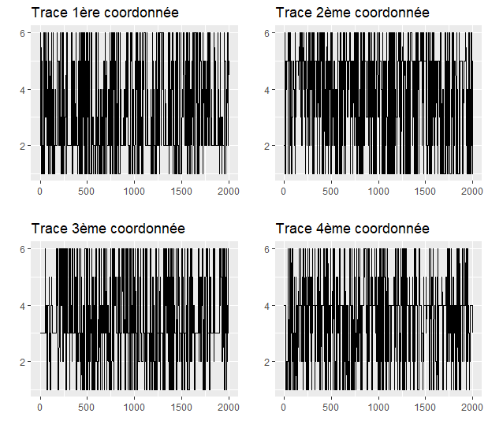
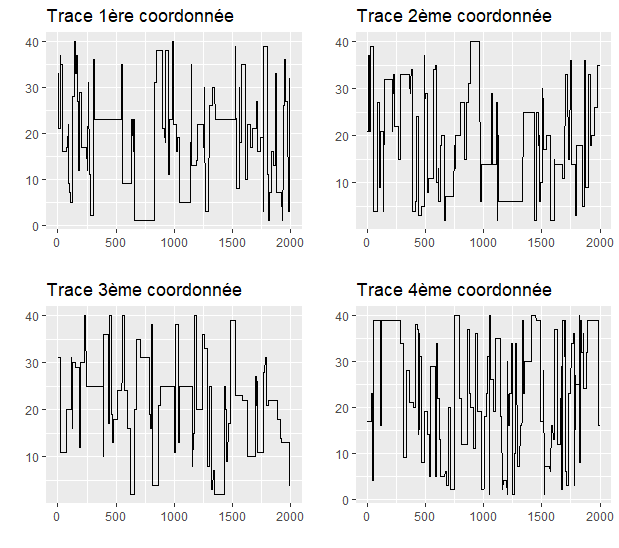
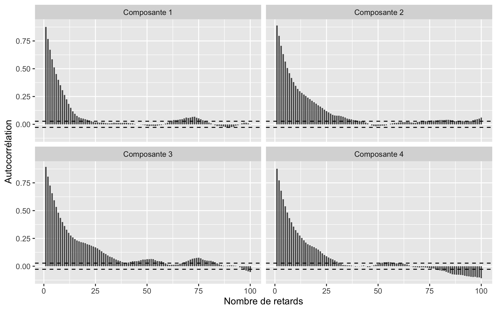
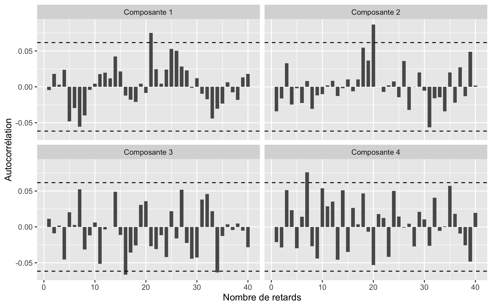

```{r setup, include=FALSE}
knitr::opts_chunk$set(echo = TRUE,
                      cache = FALSE)
library(knitr)
library(kableExtra)
library(clue)
library(mvtnorm)
library(plot3D)
library(portes)
library(shiny)
library(shinyjs)
library(shinyWidgets)
```

```{r firstProg, echo=FALSE}
# source("../ShinyApp/global.R", encoding="UTF-8",chdir = TRUE)
set.seed(1)
options(knitr.kable.NA = ' ')
creation_tableau <- function(tab, titre = "", note_debut = NULL, note_fin = NULL, nb_simuls = "5 x n x m"){
  tableau <- tab %>%
    cbind(" " = "n", "  " = rownames(.), .)
  rownames(tableau) <- NULL
  note <- c("Statistiques sur 10 seeds",
            sprintf("N = %s simulations", nb_simuls),
            "Au maximum 100 itérations")
  note <- c(note_debut, note, note_fin)
  tableau %>% 
    kable(caption = titre,
                   format.args = list(decimal.mark = ",")) %>%
    kable_styling(full_width = F)%>%
    column_spec(1:2, bold = T) %>% 
    collapse_rows(columns = 1, valign = "middle") %>% 
    add_header_above(c(" " = 2, "m" = 7)) %>% 
    footnote(general = note, general_title = "Note : ",threeparttable = TRUE)
}
```

# Introduction

### Introduction

Le Mastermind, jeu à deux joueurs où :

- Joueur 1 choisit un *code* : $n$ boules de couleur parmi $m$ couleurs possibles (classiquement $n = 4$ et $m = 6$)  
- Joueur doit deviner ce code en un minimum de coups. À chaque coup il propose un code et J1 donne :  
  * nombre de boules bien placées = *nombre de boules noires*  
  * nombre de boules de la bonne couleur, mais mal placées = *nombre de boules blanches*
  
\pause
$\longrightarrow$ Résolution par *Cross-Entropy*

## Rappels sur la méthode de *Cross-Entropy*
### Rappels sur la méthode de *Cross-Entropy*

Soit $\mathcal{X}$ un ensemble fini d'états et $S$ une fonction de score, on cherche le maximum de $S$ sur $\mathcal{X}$ :

\begin{equation} 
S(x^{*})=\gamma^{*}=\underset{x\in\mathcal{X}}{{\max}} S(x)
\end{equation} 

Pour le résoudre, on lui associe un problème stochastique, en définissant :
\begin{itemize}
\item un ensemble d'indicatrices $1_{\left\{ S(x)\geq\gamma\right\}}$ sur $\mathcal{X}$ pour plusieurs seuils $\gamma\in\mathbb{R}$ ;  
\item $\{f(\cdot;v),\,v\in\mathcal{V}\}$ une famille discrète de probabilités sur $\mathcal{X}$, paramétrée par un paramètre vectoriel $v$. 
\end{itemize}

Pour $u\in\mathcal{V}$, le problème est équivalent au problème d'estimation de la probabilité d'un événement rare :
$$\mathbb{P}_{u}(S(X)\geq\gamma)=\sum_{x}1_{\{S(x)\geq\gamma\}}f(x;u)=\mathbb{E}_{u}[1_{\{S(x)\geq\gamma\}}]$$

### Algorithme utilisé

\begin{enumerate}

\item<1-> \textbf{Initialisation :} on fixe arbitrairement $\hat{v}_{0}$, deux paramètres $N\in \mathbb N$ et $\rho\in]0,1[$ (ici $\rho = 0,1$), $t = 1$.  
\item<2-> On génère un échantillon $X_{1},\dots,X_{N}$ de loi $f(\cdot,v_{t-1})$, on calcule le quantile $(1-\rho)$ de la fonction score qui donne $\hat{\gamma}_{t}$ :
$$\hat{\gamma}_{t}=S_{\lceil(1-\rho)N\rceil}$$
Si $\hat{\gamma}_{t}\geq\gamma^*$ on prend $\hat{\gamma}_{t}=\gamma^*$.  

\item<3-> On utilise le même échantillon $X_{1},\dots,X_{N}$ pour trouver $\hat{v}_{t}$ :
\begin{equation}
\hat{v}_{t}=\underset{v}{argmax}\;\hat{D}(v)=\underset{v}{argmax}\frac{1}{N}\sum_{i=1}^{N}1_{\{S(X_{i})\geq\hat{\gamma}_{t}\}}\ln f(X_{i};v)
\end{equation}
\item<4-> Arrêt : si pour un certain $t\geq d$, (ici $d=5$), on a : 
$$\hat{\gamma}_{t}=\hat{\gamma}_{t-1}=\dots=\hat{\gamma}_{t-d}$$
alors on arrête l'algorithme.
\end{enumerate}

### Smoothed updating

Plutôt que de mettre à jour directement $\hat{v}_{t-1}$ l'équation, nous faisons une mise à jour lissée -- \emph{smoothed updating} :
$$
\hat{v}_{t}=\alpha\tilde{v}_{t}+(1-\alpha)\hat{v}_{t-1}
$$
avec $\tilde{v}_{t}$ la valeur obtenue en résolvant le problème d'optimisation. 

\textbf{Intérêt} : éviter l'occurence de 0 et de 1

# Application de la méthode de *Cross-Entropy* au Mastermind {#sec:q1}

## Paramètres utilisés dans le projet

### Paramètres utilisés dans le projet


La fonction $S$ de score correspond à la réponse du joueur 1 : plus il est grand plus le joueur 2 est proche de la bonne réponse. Pour toute proposition $x$ on a :
$$
S(x)=\frac{\omega_{noir}\times N_{\text{boules noires}}+\omega_{blanc}\times N_{\text{boules blanches}}
}{
\omega_{noir}\times n
}
$$
Habituellement $\omega_{noir}=2$ et $\omega_{blanc}=1$.

Dans l'algorithme de *Cross-Entropy*, $\rho = 0,1$ (la maximisation est donc faite sur les 10 \% meilleurs échantillons), $N = C\times\text{nombre de paramètres à estimer}$ (avec $C=5$ par défaut) et $d=5$.

## Application de la méthode de *Cross-Entropy*
### Application de la méthode de *Cross-Entropy*

Mastermind : choix de $n$ boules parmi $m$ couleurs, on les numérote de 1 à $m$.
\begin{itemize}
\item $\mathcal{X}=\left\{ 1,2,\dots,m\right\}^{n}$  
\item Génération des échantillons : $$\mathcal{V} = \left\{ \left(p_{i,j}\right)_{i,j} \in\mathcal{M}_{n,m}([0,1])\::\:\forall i,\sum_{j=1}^mp_{i,j}=1\right\} $$
\item $X=(X_{1},\dots,X_{n})\in\mathcal{X}$ tirées aléatoirement selon $p_{1},\dots,p_{n}$, la $j$ \ieme composante de $p_{i}$ étant égale à $p_{ij}=\mathbb{P}(X_{i}=j)$ : probabilité d'avoir une boule de couleur $j$ en $i$ème position.
\item Initialisation : vecteurs de probabilité uniformes pour chaque couleur
$$
\hat{v}_{0}=\left(\frac{1}{m}\right)_{i=1..n,j=1..m}
$$
\item Estimation : $p_{k,l}=\frac{\sum_{i=1}^{N}1_{\{S(X_{i})\geq\hat{\gamma}_{t}\}}1_{\left\{ X_{i,k}=l\right\} }}{\sum_{i=1}^{N}1_{\{S(X_{i})\geq\hat{\gamma}_{t}\}}}$
\end{itemize}

## Résultats
### Résultats

```{r tabq1convmed, echo=FALSE}
stats <- readRDS("Resultats/statsq1.RDS")
creation_tableau(stats$it_conv_med, titre = "Médiane du numéro de simulation de convergence")
```


### Résultats

```{r tabq1erreur, echo=FALSE}
creation_tableau(round(stats$erreur_finale,3), titre = "Moyenne de l'erreur à la simulation de convergence",
                 note_debut = "L'erreur est définie comme 1 - gamma_T")
```

### Résultats

```{r tabq1nbnonconv, echo=FALSE}
creation_tableau(stats$nb_non_conv,
                 titre = "Nombre de simulations n'ayant pas convergé vers la bonne valeur")
```

### Résultats

```{r tabq1tempsconv, echo=FALSE}
creation_tableau(round(stats$temps_conv),
                 titre = "Moyenne du temps de calcul jusqu'à la convergence (en secondes)")
```

# Restriction aux permutations

## Adaptation de l'algorithme précédent

### Adaptation de l'algorithme précédent

Joueur 1 choisit obligatoirement une \textbf{permutation}. On adapte alors l'algorithme :
\begin{itemize}
\item Initialisation : la première boule est générée en tirant un entier $x_1$ selon la loi de probabilité discrète donnée par $p_{1,\cdot} = (p_{1,1},\dots, p_{1,m})$. On pose $k=1$ et $P^{(1)} = P$.
\item Itération : $P^{(k+1)}$ est obtenue en remplaçant la colonne $k$ de $P^{(k)}$ par 0 et en normalisant les lignes pour que leur somme valent 1. $x_{k+1}$ est alors obtenu en faisant un tirage d'une loi discrète donnée par la ligne $k+1$ de $P^{(k+1)}$. 
\item Si $k=n$ alors on arrête, sinon on pose $k=k+1$ et on répéte l'étape 2.
\end{itemize}
Les autres étapes de l'algorithme restent les mêmes.

## Estimation
### Estimation

\begin{itemize}
\item La méthode d'estimation upour mettre à jour les $p_{i,j}$ reste la même.
\item $P=(p_{i,j})$ s'interprète de la même façon que précédemment : la loi des $X_i$ est la même.
\item La formule de mise à jour des paramètres s'écrit :
$$p_{k,l}=\frac{
\sum_{i=1}^{N}1_{\{S(X_{i})\geq\hat{\gamma}_{t}\}}1_{\left\{ X_{i,k}=l\right\} }
1_{\{X_{i}\text{ permutation}\}}
}{
\sum_{i=1}^{N}1_{\{S(X_{i})\geq\hat{\gamma}_{t}\}}
1_{\{X_{i}\text{ permutation}\}}
}$$
\end{itemize}

Il est donc possible de mettre à jour les paramètres en appliquant la méthode de génération des échantillons de la partie mais beaucoup d'échantillons ne seraient plus pertinents : le nouvel algorithme de génération permet juste d'améliorer le processus de génération en ne proposant que des  permutations, on a $1_{\{X_{i}\text{ permutation}\}} = 1$.

## Résultats (1)
### Résultats

```{r tabq2convmed, echo=FALSE}
stats <- readRDS("Resultats/statsq2.RDS")
note_debut <- "S'il n'y a pas convergence les statistiques ne sont pas calculées"
creation_tableau(stats$it_conv_med, titre = "Médiane du numéro de simulation de convergence",
                 note_debut = note_debut)
```

### Résultats

```{r tabq2erreur, echo=FALSE}
creation_tableau(round(stats$erreur_finale,3), titre = "Moyenne de l'erreur à la simulation de convergence",
                 note_debut = c(note_debut, "L'erreur est définie comme 1 - gamma_T"))
```

### Résultats

```{r tabq2nbnonconv, echo=FALSE}
creation_tableau(stats$nb_non_conv,
                 titre = "Nombre de simulations n'ayant pas convergé vers la bonne valeur")
```

### Résultats

```{r tabq2tempsconv, echo=FALSE}
creation_tableau(round(stats$temps_conv),
                 titre = "Moyenne du temps de calcul jusqu'à la convergence (en secondes)",
                 note_debut = note_debut)
```

### Comparaison questions 1 et 2


Le nombre d'itérations nécessaires pour converger est plus faible dans la méthode de la question 2, en adaptant l'algorithme pour ne tirer que des permutations, mais l'algorithme est plus gourmand en temps de calcul.

Cela vient du mécanisme utilisé pour tiré les échantillons qui a une complexité plus importante.


## Utilisation d'une loi spécifique pour générer les permutations

### Utilisation d'une loi spécifique pour générer les permutations

Loi sur l'ensemble des permutations : $\pi_{\lambda,x^*}(x) \propto \exp{(-\lambda d(x,x^{*}))}$

Pour générer les échantillons on utilise l'algorithme de Metropolis-Hastings.

Pour la mise en oeuvre de la méthode de *Cross-Entropy*, on va mettre à jour $\lambda$ et $x^*$ à chaque itération.

Le critère d'arrêt qui est utilisé est $x^*=y$ (i.e. $S(x^*)=1$).

Nous avons ici $n+1$ paramètres à estimer, nous générons donc $N = C\times (n+1)$ échantillons à chaque itération de la *Cross-Entropy*.

### Algorithme utilisé
\begin{itemize}
\item Initialisation : on tire aléatoire $x^*_0$ et on prend $\lambda_0=1$.
\item  On génère un échantillon $X_{1},\dots,X_{N}$, $N=5\times (n+1)$, de loi $\pi_{\lambda_t,x^*_t}$. On calcule le quantile 0,90 de la fonction score qui donne $\hat{\gamma}_{t}$ : $\hat{\gamma}_{t}=S_{\lceil0.9N\rceil}$
\item On utilise le même échantillon $X_{1},\dots,X_{N}$ pour trouver $\tilde x_{t+1}$. Si $S(\tilde x_{t+1})\geq S(x^*_t)$ alors $x^*_{t+1} = \tilde x_{t+1}$, sinon $x^*_{t+1}=x^*_{t}$. On fixe $\lambda_{t+1}=1$
\item Arrêt : si pour un certain $t$, $S(x^*_{t})=1$ alors on arrête l'algorithme.
\end{itemize}

### Génération de l'échantillon : Metropolis-Hastings

Algorithme de Metropolis-Hastings avec le mécanisme de proposition suivant : inverser deux éléments de la permutation (symétrique).

Pour $m=n$, les $X_i$ sont des vraies permutations sur $\{1,\dots,m\}$.
\begin{itemize}
\item Initialisation : on choisit $x_0$ une permutation au hasard de $\{1,\dots,m\}$ et on fixe $t=0$.
\item Itération : 
\begin{itemize}
\item On permute au hasard deux éléments de $x_t$ et on note $x'$ la nouvelle permutation (on fait donc une transposition de $x_t$).
\item On calcule la probabilité d'acceptation : $r(x',x_t)=\min\left(1,\,\frac{\pi_{\lambda,x^*}(x')}{\pi_{\lambda,x^*}(x_{t})}\right)
=\min\left(1,\,\mathrm{e^{-\lambda(d(x',x^{*})-d(x_{t},x^{*}))}}\right)$
\item Acceptation ou rejet : on génére une loi uniforme $u\in[0,1]$. Si $u \leq r(x',x_{t}) $ alors on accepte le nouvel état et on pose $x_{t+1}=x'$, sinon $x_{t+1}=x_{t}$.
\item Incrémentation : $t=t+1$.
\end{itemize}
\end{itemize}

### Génération de l'échantillon : Metropolis-Hastings

Pour $m>n$, $x^*$ ne peut être une vraie permutation. Nous raisonnons de la même façon en modifiant deux étapes :
\begin{itemize}
\item Dans le mécanisme de proposition nous inversons deux coordonnées mais en imposant qu'au moins une des deux soit plus petite que $n$ ;
\item Dans le calcul de la probabilité d'acceptation nous ne calculons la distance de Hamming que sur les $n$ premières coordonnées $x'$ et $x_t$ (comme $x^*$ est un vecteur de taille $n$) ;
\end{itemize}

$d(x',x^{*})-d(x_{t},x^{*})\in\{-2,-1,0,1,2\}$ : si par rapport à $x_t$ dans $x'$ ne diminue pas la distance de Hamming à $x^{*}$ alors on accepte le nouvel état ; s'il y a pas de nouvel élément mal placé alors on accepte $x'$ avec une probabilité de $e^{-\lambda}$.

Pour $\lambda>2$ la probabilité d'accepter un nouvel état moins proche que $x_t$ de $x^*$ est donc inférieure à 14 % et pour $\lambda>3$ cette probabilité inférieure à 5 %.
Pour $\lambda$ grand on converge donc vers $x^*$ et tous les échantillons seront égaux à $x^*$.

### Traitements spécifiques

L'algorithme de Metropolis-Hastings a deux désavantages :
\begin{enumerate}
\item Pour générer la loi cible, il construit itérativement une chaîne de Markov qui converge vers cette loi cible. Les échantillons initiaux peuvent donc suivre une distribution très différente de celle recherché. Il est donc nécessaire de rejetter une partie importante des échantillons initiaux (*burn-in*). C'est corrigé en enlevant les $250\times m$ premières observations.
\item  Par construction, les échantillons proches sont corrélés entre eux. Pour générer des échantillons indépendants il faut donc en rejeter et ne garder que les $n$ièmes échantillons. Dans notre cas nous prenons $n=100$ pour toutes les simulations.
\end{enumerate}

### Gestion du burn-in: n = 4 et m = 6

```{r, fig.width=4, echo=FALSE, fig.cap="n = 4 et m = 6"}

```

### Gestion du burn-in : n = m = 40

```{r, fig.width=4, echo=FALSE, fig.cap="n = 40 et m = 40"}

```

### Gestion des autocorrélations 

Par construction,  les échantillons proches sont corrélés.

On peut utiliser la fonction `portes::LjungBox` pour calculer les autocorrélation : séries multivariées. 

Mais intégrer ce test dans le mécanisme de proposition est très couteux en temps. 

Garder tous les 80ièmes observations corrige ce problème. 

### Gestion des autocorrélations 

```{r acfn10m40, echo = FALSE, fig.cap="Autocorrélogrammes des quatres premières composantes des échantillons avec lambda = 1, n = 10 et m = 40"}

```

### Gestion des autocorrélations 

```{r acfn10m40corr, echo = FALSE, fig.cap="Autocorrélogrammes des quatres premières composantes des échantillons avec un pas de 80, lambda = 1, n = 10 et m = 40"}

```

### Estimation des paramètres

La littérature montre le problème de maximisation de la vraisemblance d'une loi de Mallow  peut se décomposer en deux étapes :
\begin{itemize}
\item Estimation de $x^*$ qui minimise la somme des distances de Hamming.
\item Estimation de $\lambda$ par un algorithme de type Newton-Raphston.
\end{itemize}

L'estimation des paramètres dans l'algorithme de *Cross-Entropy* est équivalent à calculer l'estimateur de vraisemblance sur les 10 % meilleurs échantillons en terme de score.


### Estimation de $x^*$

Intuitivement, le $x^*$ qui minimise la somme : $$\sum_{i=1}^N 1_{\{S(X_{i})\geq\hat{\gamma}_{t}\}}d(X_i,x^*)$$ est le $x^*=(x_1^*,\dots,x_n^*)$ tel que $x_j^*$ correspond au chiffre le plus fréquent dans la $j$ème coordonnée des 10 % meilleurs échantillons.

On part de ce principe mais en imposant que $x^*$ soit bien une permutation :

1. On crée une matrice $F=(f_{i,j})\in\mathcal M_{n,m}(\mathbb{N})$ telle $f_{i,j}$ soit égal au nombre de fois que l'entier $j$ apparait en $i$ème position parmi les 10 % meilleurs échantillon.

2. On sélectionne une composante par ligne et par colonne de $F$ de façon à ce que leur somme soit maximale


### Estimation de $\lambda$

On trouve dans la littérature la constante de normalisation de $\pi_{\lambda,x^*}$ :
$$
m!\exp(-\lambda m)\sum_{k=0}^{m}\frac{(\exp(\lambda)-1)^{k}}{k!}
$$
Le maximum de vraisemblance est alors obtenu en prenant $\lambda$ tel que :
$$
\frac{
\exp(\lambda)\sum_{k=0}^{m-1}\frac{(\exp(\lambda)-1)^{k}}{k!} -
m\sum_{k=0}^{m}\frac{(\exp(\lambda)-1)^{k}}{k!}
}{
\sum_{k=0}^{m}\frac{(\exp(\lambda)-1)^{k}}{k!}
} +
\frac{\sum_{i=1}^N 1_{\{S(X_{i})\geq\hat{\gamma}_{t}\}}d(X_i,x^*)}{\sum_{i=1}^N 1_{\{S(X_{i})\geq\hat{\gamma}_{t}\}}} = 0
$$
Problème : croissance rapide de $\lambda$ à chaque itération, si $y$ n'est pas décodé dans les premières itérations, les échantillons $X_i$ générés seront très proches de $x^*$ et on ne trouvera pas $y$.

Plusieurs test pour estimer $\lambda$ : croissance linéaire, décroissance, constance et maximum de vraisemblance. Meilleure solution : $\lambda = 1$.

## Résultats (2)
### Résultats

Il n'y a pas toujours convergence de $x^*$ vers $y$ en 100 itérations.

```{r tabq3convmed, echo=FALSE}
stats <- readRDS("Resultats/statsq3.RDS")
note_debut <- "S'il n'y a pas convergence les statistiques ne sont pas calculées"
creation_tableau(stats$it_arret_med, titre = "Médiane du numéro de simulation de convergence",
                 note_debut = note_debut)
```

### Résultats

```{r tabq3nbnonconv, echo=FALSE}
creation_tableau(stats$nb_non_conv,
                 titre = "Nombre de simulations n'ayant pas convergé vers la bonne valeur",
                 nb_simuls = "5 x (n + 1)")
```

### Résultats

```{r tabq3tempsconv, echo=FALSE}
creation_tableau(round(stats$temps_arret),
                 titre = "Moyenne du temps de calcul jusqu'à la convergence (en secondes)",
                 nb_simuls = "5 x (n + 1)",
                 note_debut = note_debut)
```

### Merci pour votre attention

L'ensemble du projet est disponible sous : https://github.com/ARKEnsae/Mastermind_Simulation

\begin{center}
\includegraphics[width = 5cm]{img/LOGO-ENSAE.png}
\end{center}


