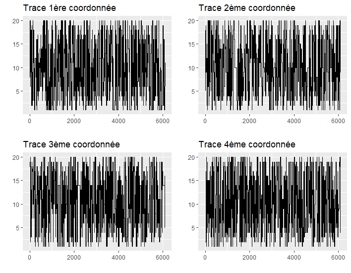
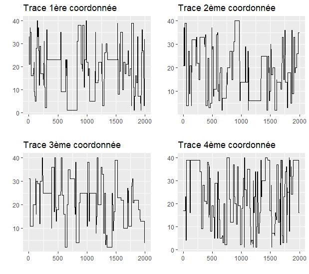
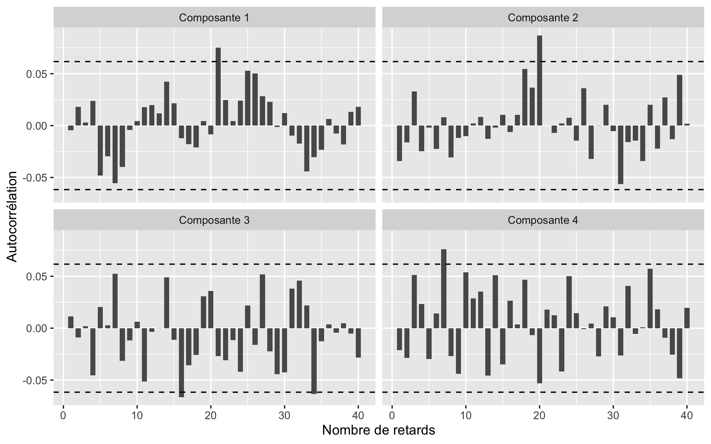
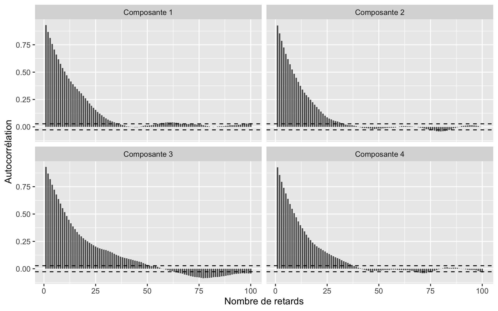

```{r setup, include=FALSE}
knitr::opts_chunk$set(echo = TRUE,
                      cache = FALSE)
library(knitr)
library(kableExtra)
library(clue)
library(mvtnorm)
library(plot3D)
library(portes)
library(shiny)
library(shinyjs)
library(shinyWidgets)
library(V8)
```

```{r firstProg, echo=FALSE}
 source("../ShinyApp/global.R", encoding="UTF-8",chdir = TRUE)
set.seed(1)
options(knitr.kable.NA = ' ')
creation_tableau <- function(tab, titre = "", note_debut = NULL, note_fin = NULL, nb_simuls = "5 x n x m"){
  tableau <- tab %>%
    cbind(" " = "n", "  " = rownames(.), .)
  rownames(tableau) <- NULL
  note <- c("Statistiques sur 10 seeds",
            sprintf("N = %s simulations", nb_simuls),
            "Au maximum 100 itérations")
  note <- c(note_debut, note, note_fin)
  tableau %>% 
    kable(caption = titre) %>%
    kable_styling(full_width = F)%>%
    column_spec(1:2, bold = T) %>% 
    collapse_rows(columns = 1, valign = "middle") %>% 
    add_header_above(c(" " = 2, "m" = 7)) %>% 
    footnote(general = note, general_title = "Note : ")
}
```
<!-- $$\renewcommand{\P}{\mathbb{P}} -->
<!-- \renewcommand{\R}{\mathbb{R}} -->
<!-- \renewcommand{\N}{\mathbb{N}} -->
<!-- \newcommand\1{\mathbb{1}} -->
<!-- \newcommand\E{\mathbb{E}} -->
<!-- \DeclareMathOperator*{\argmax}{argmax}$$ -->

# Introduction


Ce rapport décrit le projet de Monte-Carlo de Kim Antunez, Romain Lesauvage et Alain Quartier-la-Tente (Ensae, 2A), dont l'objectif est d'étudier l'application de méthodes de *Cross-Entropy* à la résolution du Mastermind.

Le Mastermind est un jeu à deux joueurs. Le premier joueur choisit un *code* : une séquence de $n$ boules de couleur (valeur standard $n = 4$), parmi $m$ couleurs possibles (valeur standard $m = 6$).
Puis, le second joueur doit deviner ce code en un minimum de coups. 
À chaque coup, le second joueur propose un code, et le premier joueur doit lui donner :

a. le nombre de boules bien placées : c'est que ce nous appelons le *nombre de boules noires* ;  
b. le nombre de boules de la bonne couleur, mais mal placées : c'est que ce nous appelons le *nombre de boules blanches*.

Par exemple, si le code à décoder est "vert-bleu-rouge-violet" et que le second joueur propose "violet-rouge-rouge-jaune" alors il y a une boule noire (une des boules rouges est bien placée) et une boule blanche (il y a bien une boule violette mais elle est mal placée).

L'objectif de ce projet est d'appliquer trois méthodes différentes pour résoudre ce problème :

1. Mettre en oeuvre un algorithme basé sur la méthode *Cross-Entropy* (section \@ref(sec:q1)).

2. Adapter la méthode précédente au cas où le premier joueur doit forcément choisir une permutation comme code (i.e. chaque couleur ne peut apparaître qu’une seule fois, donc $m \geq n$) (section \@ref(sec:q2)).

3. En utilisant, au sein d'une approche de *Cross-Entropy*, la loi suivante sur l'ensemble des permutations (section \@ref(sec:q3)) :
$$
\pi_{\lambda, x^*}(x)\propto\exp{(−\lambda d(x, x^{*}))}
$$
Avec $\lambda > 0$ et $d(x, x^{*})$ la distance de Hamming entre $x$ et $x^{*}$ (i.e. : le nombre d'emplacements pour lesquels les deux permutations sont différentes).

Tous les codes utilisés (langage `R`) sont disponibles dans la partie \@ref(sec:enscode). 
Une application web de démonstration faite également à l'aide de `R` (package `shiny`) est disponible à l'adresse suivante : https://antuki.shinyapps.io/mastermind. 

## Rappels sur la méthode de *Cross-Entropy*

La méthode de *Cross-Entropy* est une méthode utilisée pour estimer des probabilités d'événements rares. Elle peut aussi être adaptée pour résoudre des problèmes d'optimisation combinatoire et c'est dans ce cadre que nous l'utiliserons dans notre projet.

Le problème est le suivant : soit $\mathcal{X}$ un ensemble fini d'états et $S$ une fonction de score. L'objectif est de trouver le maximum de $S$ sur $\mathcal{X}$ (noté $\gamma^{*}$) et les points pour lesquels ce maximum est atteint ($x^*$). Si on note $\gamma^{*}$ ce maximum, on cherche donc :
\begin{equation} 
S(x^{*})=\gamma^{*}=\underset{x\in\mathcal{X}}{{\max}} S(x)
  (\#eq:defscore)
\end{equation} 
Pour le résoudre, on lui associe un problème stochastique d'estimation de probabilité d'événements rares. On définit :

- un ensemble d'indicatrices $\1_{\left\{ S(x)\geq\gamma\right\}}$ sur $\mathcal{X}$ pour plusieurs seuils $\gamma\in\mathbb{R}$ ;  
-  $\{f(\cdot;v),\,v\in\mathcal{V}\}$ une famille de probabilités sur $\mathcal{X}$, paramétrée par un paramètre vectoriel $v$. 

Pour $u\in\mathcal{V}$, le problème \@ref(eq:defscore) est équivalent au problème d'estimation de la probabilité :
$$\mathbb{P}_{u}(S(X)\geq\gamma)=\sum_{x}\1_{\{S(x)\geq\gamma\}}f(x;u)=\mathbb{E}_{u}[\1_{\{S(x)\geq\gamma\}}]$$

---

L'algorithme utilisé est le suivant :

1. Initialisation : on fixe arbitrairement $\hat{v}_{0}$, deux paramètres $N\in \mathbb N$ et $\rho\in]0,1[$, $t = 1$.  
2. On génère un échantillon $X_{1},\dots,X_{N}$ de loi $f(\cdot,v_{t-1})$, on calcule le quantile $(1-\rho)$ de la fonction score qui donne $\hat{\gamma}_{t}$ :
$$\hat{\gamma}_{t}=S_{\lceil(1-\rho)N\rceil}$$
Si $\hat{\gamma}_{t}\geq\gamma^*$ on prend $\hat{\gamma}_{t}=\gamma^*$.  
3. On utilise le même échantillon $X_{1},\dots,X_{N}$ pour trouver $\hat{v}_{t}$ :
\begin{equation} 
\DeclareMathOperator*{\argmax}{argmax}
\hat{v}_{t}=\underset{v}{\argmax}\;\hat{D}(v)=\underset{v}{\argmax}\frac{1}{N}\sum_{i=1}^{N}\1_{\{S(X_{i})\geq\hat{\gamma}_{t}\}}\ln f(X_{i};v)
  (\#eq:maxopti)
\end{equation} 
En d’autres termes, $\hat{v}_{t}$ correspond à l’estimateur du maximum de vraisemblance de $\hat{v}_{t-1}$ basé sur les $\rho$ meilleures réalisations en termes de score.

4. Arrêt : si pour un certain $t\geq d$, (par exemple $d=5$), on a : 
$$\hat{\gamma}_{t}=\hat{\gamma}_{t-1}=\dots=\hat{\gamma}_{t-d}$$
alors on arrête l'algorithme.

---

### Smoothed updating

Plutôt que de mettre à jour directement $\hat{v}_{t-1}$ l'équation \@ref(eq:maxopti), nous faisons une mise à jour lissée -- *smoothed updating* :
$$
\hat{v}_{t}=\alpha\tilde{v}_{t}+(1-\alpha)\hat{v}_{t-1}
$$
avec $\tilde{v}_{t}$ la valeur obtenue en résolvant le problème \ref{eq:maxopti}. 
Dans le cas de problèmes d'optimisation avec des variables discrètes (comme ici), cela permet d'éviter l'occurence de 0 ou de 1 dans les paramètres des vecteurs. 
En effet, dès lors que les valeurs 0 ou 1 apparaissent, elles restent souvent fixées à ces valeurs dans les itérations suivantes, ce qui peut amener à converger vers la mauvaise valeur. Le *smoothed updating* permet alors d'éviter cela.
@de2005tutorial suggèrent de prendre $0,4\leq\alpha\leq0,9$ : dans ce projet nous utilisons par défaut $\alpha = 0,7$.

# Application de la méthode de *Cross-Entropy* au Mastermind {#sec:q1}


## Paramètres utilisés dans le projet

Dans ce projet  sur le Mastermind, la fonction $S$ de score correspond à la réponse du joueur 1 : plus il est grand plus le joueur 2 est proche de la bonne réponse. Pour toute proposition $x$ on a :
$$
S(x)=\frac{\omega_{noir}\times N_{\text{boules noires}}+\omega_{blanc}\times N_{\text{boules blanches}}
}{
\omega_{noir}\times n
}
$$
Avec $n$ le nombre de boules à deviner, $\omega_{noir}>\omega_{blanc}$, nous choisissons $\omega_{noir}=2$ et $\omega_{blanc}=1$.

Avec cette fonction de score nous supposons qu'une boule noire compte plus qu'une boule blanche. La constante de normalisation $\omega_{noir}\times n$ permet de faciliter les comparaisons lorsque l'on fait changer le nombre de boules à deviner : dans tous les cas on cherche $x^*$ tel que $S(x^*) = 1$.

Dans l'algorithme de *Cross-Entropy* nous utilisons $\rho = 0,1$ (à l'étape 3 la maximisation est donc faite sur les 10 \% meilleurs échantillons), $N = C\times\text{nombre de paramètres à estimer}$ (avec $C=5$ par défaut) et $d=5$.

## Application de la méthode de *Cross-Entropy*

Dans le Mastermind il faut choisir $n$ boules parmi $m$ couleurs. En numérotant les couleurs de 1 à $m$ on a :

- $\mathcal{X}=\left\{ 1,2,\dots,m\right\}^{n}$  

-   Pour générer les échantillons, la famille de lois utilisée est :
$$\mathcal{V} = \left\{ \left(p_{i,j}\right)_{i,j} \in\mathcal{M}_{n,m}([0,1])\::\:\forall i,\sum_{j=1}^mp_{i,j}=1\right\} $$
Ainsi, les composantes du vecteur $X=(X_{1},\dots,X_{n})\in\mathcal{X}$ (une proposition) sont tirées aléatoirement de façons à ce que leur distribution soit
déterminée par une suite $p_{1},\dots,p_{n}$ de vecteurs de probabilités.
La $j$ \ieme composante de $p_{i}$ étant égale à $p_{ij}=\P(X_{i}=j)$ : c'est la probabilité d'avoir une boule de couleur $j$ en $i$ème position.

- L'initialisation est telle que les vecteurs de probabilité sont uniformes pour chaque couleur : 
$$
\hat{v}_{0}=\left(\frac{1}{m}\right)_{i=1..n,j=1..m}
$$
La maximisation de la vraisemblance nous permet d'obtenir cette formule pour le calcul des paramètres optimaux (voir démonstration partie \@ref(sec:demmajparam)) :


$$p_{k,l}=\frac{\sum_{i=1}^{N}\1_{\{S(X_{i})\geq\hat{\gamma}_{t}\}}\1_{\left\{ X_{i,k}=l\right\} }}{\sum_{i=1}^{N}\1_{\{S(X_{i})\geq\hat{\gamma}_{t}\}}}$$


- À chaque itération nous générons $N = C\times m\times n$ échantillons. Pour générer $X=(X_{1},\dots,X_{n})\in\mathcal{X}$, nous pouvons générer chaque composante $X_i$ de manière indépendante : il s'agit d'une loi discrète sur $\left\{ 1,2,\dots,m\right\}$ avec des probabilités $p_i=(p_{i,1},\dots,p_{i,m})$. Pour cela, sous R il suffit d'utiliser la fonction `sample` en utilisant l'option `prob` pour définir le vecteur de probabilités. Cette fonction peut être réécrite aisément à l'aide d'un tirage d'une loi uniforme discrète. Pour cela, prenons un nombre très grand, par exemple $taille =$ 100 000, et créons un vecteur contenant des entiers de 1 à $m$, chaque entier $j$ étant répété $taille\times p_{i,j}$ fois. En tirant une position au hasard dans ce vecteur (i.e. en tirant un entier au hasard via une loi uniforme entre 1 et $taille$), l'entier associé sera égal à $j$ avec une probabilité environ égale à $p_{i,j}$. Sous R on peut coder cette fonction de la façon suivante :

```{r sample2}
sample2 <- function(x, size, prob, replace = TRUE){
  taille <- 100000
  choix <- lapply(seq_along(x), function(i){
    rep(x[i], round(prob[i]*taille))
  })
  choix <- unlist(choix)
  if(replace){
    resultat = sapply(seq_len(size), function(i){
      indice = as.integer(runif(1,1,taille+1))
      choix[indice]
    })
    
  } else {
    resultat = vector(mode = mode(x),
                      length = size)
    sous_choix = choix
    for(k in 1:size){
      taille_sc = length(sous_choix)
      indice = as.integer(runif(1,1,taille_sc+1))
      resultat[k] = sous_choix[indice]
      sous_choix = sous_choix[sous_choix != sous_choix[indice]]
    } 
  }
  resultat
}
set.seed(1)
prob = c(1/4, 1/3, 5/12) # soit : 0.250, 0.333 et 0.417
# On retrouve les proportions :
table(sample2(x=1:3,size = 100000, prob = prob, replace = TRUE))/100000
```

## Résultats

Voici un exemple simple de combinaison $y$ à deviner ($n = 4$, $m = 5$) :

<canvas id="myCanvas1" width="25" height="25"></canvas><canvas id="myCanvas2" width="25" height="25"></canvas><canvas id="myCanvas3" width="25" height="25"></canvas><canvas id="myCanvas4" width="25" height="25"></canvas>

<script>
var canvas = document.getElementById('myCanvas1');
var context = canvas.getContext('2d');
context.beginPath();
context.arc(10, 10, 10, 0, 2 * Math.PI, true);
context.fillStyle = '#0000FF';
context.fill();
context.stroke();

var canvas = document.getElementById('myCanvas2');
var context = canvas.getContext('2d');
context.beginPath();
context.arc(10, 10, 10, 0, 2 * Math.PI, true);
context.fillStyle = '#FFFF00';
context.fill();
context.stroke();

var canvas = document.getElementById('myCanvas3');
var context = canvas.getContext('2d');
context.beginPath();
context.arc(10, 10, 10, 0, 2 * Math.PI, true);
context.fillStyle = '#FF3232';
context.fill();
context.stroke();

var canvas = document.getElementById('myCanvas4');
var context = canvas.getContext('2d');
context.beginPath();
context.arc(10, 10, 10, 0, 2 * Math.PI, true);
context.fillStyle = '#FFCFFF';
context.fill();
context.stroke();

</script>

L'algorithme appliqué à cet exemple converge à la 9ème étape (temps d’exécution : 0,05 seconde), et vers la bonne valeur de y. 

```{r modeleq1, echo=FALSE,fig.align='center'}
modele <- readRDS("Resultats/q1vs2.RDS")
modele <- modele[[8]][[1]]
mise_en_forme_tableau(modele,matriciel=TRUE)
```


Voici une représentation graphique de la matrice de probabilités à chaque itération : 


```{r modeleq1bis, echo=FALSE,fig.align='center'}
par(mfrow=c(2,4))
for(i in 1:8){
  dessiner_histo(modele$P_hat_liste,i, c("#0000FF","#00FF00","#FF3232","#FFFF00","#CF00CF","#FFCFFF"),main=paste0("\n\nItération ",i)) 
} 
```

Les tableaux \@ref(tab:tabq1convmed), \@ref(tab:tabq1erreur), \@ref(tab:tabq1tempsconv) et  \@ref(tab:tabq1nbnonconv) présentent les résultats sur plusieurs valeurs de $m$ et $n$ avec 10 simulations pour chaque paramètre (seed de 1 à 10).
Pour toutes les simulations, la convergence se fait en moins de 100 itérations, mais pas toujours vers la bonne valeur (voir tableaux  \@ref(tab:tabq1erreur) et \@ref(tab:tabq1nbnonconv)).

<style>
  .col2 {
    columns: 2 200px;         /* number of columns and width in pixels*/
    -webkit-columns: 2 200px; /* chrome, safari */
    -moz-columns: 2 200px;    /* firefox */
  }
  .col3 {
    columns: 3 100px;
    -webkit-columns: 3 100px;
    -moz-columns: 3 100px;
  }
</style>

<div class="col2">
```{r tabq1convmed, echo=FALSE}
stats <- readRDS("Resultats/statsq1.RDS")
creation_tableau(stats$it_conv_med, titre = "Itération médiane de convergence")
```

```{r tabq1erreur, echo=FALSE}
creation_tableau(round(stats$erreur_finale,3), titre = "Moyenne de l'erreur à la simulation de convergence",
                 note_debut = "L'erreur est définie comme 1 - gamma_T")
```
</div>

<div class="col2">
```{r tabq1nbnonconv, echo=FALSE}
creation_tableau(stats$nb_non_conv,
                 titre = "Nombre de simulations n'ayant pas convergé vers la bonne valeur")
```

```{r tabq1tempsconv, echo=FALSE}
creation_tableau(round(stats$temps_conv),
                 titre = "Moyenne du temps de calcul jusqu'à la convergence (en secondes)")
```

</div>


## Démonstration de la formule de mise à jour des paramètres {#sec:demmajparam}

La densité s'écrit :
$$
f(X;p)=\prod_{i=1}^{n}\prod_{j=1}^{m}p_{i,j}^{\1_{\left\{ X_{i}=j\right\} }}
$$

Il vient :
$$
\ln f(X;p)=\sum_{i=1}^{n}\sum_{j=1}^{m}\1_{\left\{ X_{i}=j\right\} }\ln p_{i,j}
$$
Et :
$$
\frac{\partial}{\partial p_{k,l}}\ln f(X;p)=\frac{\partial}{\partial p_{k,l}}\sum_{j=1}^{m}\1_{\left\{ X_{k}=j\right\} }\ln p_{k,j}=\frac{\1_{\left\{ X_{k}=l\right\} }}{p_{k,l}}
$$

Soit maintenant un échantillon de taille $N$, $X_{1},\dots,X_{N}\overset{i.i.d}{\sim}X$. Notons$X_{i}=(X_{i,1},\dots,X_{i,n})\in\mathcal{X}$. Le programme
de maximisation \ref{eq:maxopti} s'écrit comme un problème de maximisation sous
contrainte :
$$
\begin{cases}
\underset{p_{i,j}}{\max} & \sum_{i=1}^{N}\1_{\{S(X_{i})\geq\hat{\gamma}_{t}\}}\ln f(X_{i};v)\\
s.c & \forall i\::\:\sum_{j=1}^{m}p_{i,j}=1
\end{cases}
$$
Le Lagrangien s'écrit :
$$
\mathcal{L}=\sum_{i=1}^{N}\1_{\{S(X_{i})\geq\hat{\gamma}_{t}\}}\ln f(X_{i};v)+\sum_{i=1}^{n}\lambda_{i}\left(\sum_{j=1}^{m}p_{i,j}-1\right)
$$

La condition d'optimalité en $p_{k,l}$ :
$$
\frac{\partial}{\partial p_{k,l}}\mathcal{L}=0\implies\sum_{i=1}^{N}\1_{\{S(X_{i})\geq\hat{\gamma}_{t}\}}\frac{\1_{\left\{ X_{i,k}=l\right\} }}{p_{k,l}}-\lambda_{k}=0
$$

Soit : 
$$
\sum_{i=1}^{N}\1_{\{S(X_{i})\geq\hat{\gamma}_{t}\}}\1_{\left\{ X_{i,k}=l\right\} }=\lambda_{k}p_{k,l}
$$

En sommant sur $l$ et en utilisant la condition sur les $p_{i,j}$, il vient :
$$
\lambda_{k}=\sum_{i=1}^{N}\1_{\{S(X_{i})\geq\hat{\gamma}_{t}\}}\underbrace{\sum_{l=1}^{m}\1_{\left\{ X_{i,k}=l\right\} }}_{=1}
$$

D'où la formule de mise à jour :

$$
p_{k,l}=\frac{\sum_{i=1}^{N}\1_{\{S(X_{i})\geq\hat{\gamma}_{t}\}}\1_{\left\{ X_{i,k}=l\right\} }}{\sum_{i=1}^{N}\1_{\{S(X_{i})\geq\hat{\gamma}_{t}\}}}
$$


# Restriction aux permutations

Dans cette partie nous supposons que le premier joueur doit forcément choisir comme code une permutation (chaque couleur apparaît au plus une fois et donc $m\geq n$).

## Adaptation de l'algorithme précédent {#sec:q2}

L'énoncé suggère de garder le même algorithme mais en adaptant le mécanisme de génération pour générer des « permutations ». En notant toujours $P=(p_{i,j})$ la matrice des paramètres associée à $X=(X_{1},\dots,X_{n})\in\mathcal{X}$, $X$ est généré de la façon suivante :

1. Initialisation : la première boule est générée de la même façon que précédemment en tirant un entier $x_1$ selon la loi de probabilité discrète donnée par $p_{1,\cdot} = (p_{1,1},\dots, p_{1,m})$. On pose $k=1$ et $P^{(1)} = P$.

2. Itération : $P^{(k+1)}$ est obtenue en remplaçant la colonne $k$ de $P^{(k)}$ par 0 et en normalisant les lignes pour que leur somme valent 1. $x_{k+1}$ est alors obtenu en faisant un tirage d'une loi discrète donnée par la ligne $k+1$ de $P^{(k+1)}$. Sous R, il n'est pas nécessaire de renormaliser ses lignes, cela est pris en compte par le paramètre `prob` de la fonction `sample`.

3. Si $k=n$ alors on arrête, sinon on pose $k=k+1$ et on répéte l'étape 2.


Comme suggéré par l'énoncé, les autres étapes de l'algorithme restent les mêmes :

- L'initialisation est telle que les vecteurs de probabilité sont uniformes pour chaque couleur : 
$$
\hat{v}_{0}=\left(\frac{1}{m}\right)_{i=1..n,j=1..m}
$$
et la formule pour le calcul des paramètres optimaux est : $$p_{k,l}=\frac{\sum_{i=1}^{N}\1_{\{S(X_{i})\geq\hat{\gamma}_{t}\}}\1_{\left\{ X_{i,k}=l\right\} }}{\sum_{i=1}^{N}\1_{\{S(X_{i})\geq\hat{\gamma}_{t}\}}}$$  

- À chaque itération nous générons $N = C\times m\times n$ échantillons. La méthode d'estimation utilisée dans la partie précédente pour mettre à jour les $p_{i,j}$ reste la même.

En effet $P=(p_{i,j})$ s'interprète de la même façon que précédemment : la loi des $X_i$ reste la même. De la même façon que dans la partie \@ref(sec:demmajparam), on peut montrer que la formule de mise à jour des paramètres s'écrit :
$$p_{k,l}=\frac{
\sum_{i=1}^{N}\1_{\{S(X_{i})\geq\hat{\gamma}_{t}\}}\1_{\left\{ X_{i,k}=l\right\} }
\1_{\{X_{i}\text{ permutation}\}}
}{
\sum_{i=1}^{N}\1_{\{S(X_{i})\geq\hat{\gamma}_{t}\}}
\1_{\{X_{i}\text{ permutation}\}}
}$$

Il est donc possible de mettre à jour les paramètres en appliquant la méthode de génération des échantillons de la partie \@ref(sec:q1). En revanche, dans ce cas, beaucoup d'échantillons (tous ceux pour lesquels une couleur est proposée à deux emplacements différents) ne seraient plus pertinents.

Le nouvel algorithme de génération permet d'améliorer le processus de génération en ne proposant que des candidats pertinents, et donc d'avoir une convergence plus rapide. Puisque l'on ne génère que des permutations, on a $\1_{\{X_{i}\text{ permutation}\}} = 1$, ce qui nous fait retrouver la formule de la partie précédente.

### Résultats

Revenons à notre exemple de combinaison $y$ à deviner ($n = 4$, $m = 5$) :

<canvas id="myCanvasA" width="25" height="25"></canvas><canvas id="myCanvasB" width="25" height="25"></canvas><canvas id="myCanvasC" width="25" height="25"></canvas><canvas id="myCanvasD" width="25" height="25"></canvas>

<script>
var canvas = document.getElementById('myCanvasA');
var context = canvas.getContext('2d');
context.beginPath();
context.arc(10, 10, 10, 0, 2 * Math.PI, true);
context.fillStyle = '#0000FF';
context.fill();
context.stroke();

var canvas = document.getElementById('myCanvasB');
var context = canvas.getContext('2d');
context.beginPath();
context.arc(10, 10, 10, 0, 2 * Math.PI, true);
context.fillStyle = '#FFFF00';
context.fill();
context.stroke();

var canvas = document.getElementById('myCanvasC');
var context = canvas.getContext('2d');
context.beginPath();
context.arc(10, 10, 10, 0, 2 * Math.PI, true);
context.fillStyle = '#FF3232';
context.fill();
context.stroke();

var canvas = document.getElementById('myCanvasD');
var context = canvas.getContext('2d');
context.beginPath();
context.arc(10, 10, 10, 0, 2 * Math.PI, true);
context.fillStyle = '#FFCFFF';
context.fill();
context.stroke();

</script>

Le deuxième algorithme appliqué à cet exemple converge cette fois-ci plus tôt, à la 8ème étape, toujours vers la bonne valeur de y. Le temps d'exécution (0,1 seconde) est supérieur à précédemment car la loi de génération des échantillons sans remise est plus chronophage.

```{r modeleq2, echo=FALSE,fig.align='center'}
modele <- readRDS("Resultats/q2.RDS")
modele <- modele[[8]][[1]]
mise_en_forme_tableau(modele,matriciel=TRUE)
```

Voici une représentation graphique de la matrice de probabilités à chaque itération : 


```{r modeleq2bis, echo=FALSE,fig.align='center'}
par(mfrow=c(2,4))
for(i in 1:8){
  dessiner_histo(modele$P_hat_liste,i, c("#0000FF","#00FF00","#FF3232","#FFFF00","#CF00CF","#FFCFFF"),main=paste0("\n\nItération ",i)) 
} 
```


Les tableaux \@ref(tab:tabq2convmed), \@ref(tab:tabq2erreur), \@ref(tab:tabq2tempsconv) et  \@ref(tab:tabq2nbnonconv) présentent les résultats sur plusieurs valeurs de $m$ et $n$ avec 10 simulations pour chaques paramètres (seed de 1 à 10). Pour toutes les simulations on a une convergence en moins de 100 itérations vers la bonne valeur.

<div class="col2">
```{r tabq2convmed, echo=FALSE}
stats <- readRDS("Resultats/statsq2.RDS")
note_debut <- "S'il n'y a pas convergence les statistiques ne sont pas calculées"
creation_tableau(stats$it_conv_med, titre = "Itération médiane de convergence",
                 note_debut = note_debut)
```

```{r tabq2erreur, echo=FALSE}
creation_tableau(round(stats$erreur_finale,3), titre = "Moyenne de l'erreur à la simulation de convergence",
                 note_debut = c(note_debut, "L'erreur est définie comme 1 - gamma_T"))
```
</div>
<div class="col2">
```{r tabq2nbnonconv, echo=FALSE}
creation_tableau(stats$nb_non_conv,
                 titre = "Nombre de simulations n'ayant pas convergé vers la bonne valeur")
```

```{r tabq2tempsconv, echo=FALSE}
creation_tableau(round(stats$temps_conv),
                 titre = "Moyenne du temps de calcul jusqu'à la convergence (en secondes)",
                 note_debut = note_debut)
```
</div>

Les tableaux \@ref(tab:tabq1vsq2convmed), \@ref(tab:tabq1vsq2erreur), \@ref(tab:tabq1vsq2nbnonconv) et \@ref(tab:tabq1vsq2tempsconv) présentent les résultats obtenus en utilisant l'algorithme de la partie \@ref(sec:q1) (qui ne suppose pas que l'on ait des permutations) mais sur les mêmes codes $y$ à déchiffrer (qui sont donc des permutations). 

<div class="col2">
```{r tabq1vsq2convmed, echo=FALSE}
stats <- readRDS("Resultats/statsq1vsq2.RDS")
creation_tableau(stats$it_conv_med, titre = "Itération médiane de convergence")
```

```{r tabq1vsq2erreur, echo=FALSE}
creation_tableau(round(stats$erreur_finale,3), titre = "Moyenne de l'erreur à la simulation de convergence",
                 note_debut = "L'erreur est définie comme 1 - gamma_T")
```
</div>

<div class="col2">
```{r tabq1vsq2nbnonconv, echo=FALSE}
creation_tableau(stats$nb_non_conv,
                 titre = "Nombre de simulations n'ayant pas convergé vers la bonne valeur")
```

```{r tabq1vsq2tempsconv, echo=FALSE}
creation_tableau(round(stats$temps_conv),
                 titre = "Moyenne du temps de calcul jusqu'à la convergence (en secondes)")
```
</div>

<i class="fas fa-arrow-alt-circle-right"></i> Même si le nombre d'itérations nécessaires pour converger est plus faible en adaptant l'algorithme pour ne tirer que des permutations, l'algorithme est plus gourmand en temps de calcul. Cela vient du mécanisme utilisé pour tirer les échantillons qui a une complexité plus importante.

```{r, echo=FALSE, include=FALSE}
library(icon) #Je sais pas pourquoi, sans ce truc ça ne s'affiche pas
icon::fa("arrow-alt-circle-right")
```

## Utilisation d'une loi spécifique pour générer les permutations {#sec:q3}

Dans cette partie, nous utilisons la loi suivante sur l'ensemble des permutations :
$$
\pi_{\lambda, x^*}(x)\propto\exp{(−\lambda d(x, x^{*}))}
$$
L'algorithme de Metropolis-Hastings (voir partie \@ref(sec:mh)) permet de générer les échantillons. Pour la mise en oeuvre de la méthode de *Cross-Entropy*, $\lambda$ et $x^*$ sont mis à jour à chaque itération. Le critère d'arrêt qui est utilisé est $x^*=y$ (i.e. $S(x^*)=1$).

Nous avons ici $n+1$ paramètres à estimer ($n$ pour $x^*$ et 1 pour $\lambda$). Nous générons donc $N = C\times (n+1)$ échantillons à chaque itération de la *Cross-Entropy*. L'algorithme que nous utilisons est le suivant :

1. Initialisation : on tire aléatoire $x^*_0$ et on prend $\lambda_0=1$.

2. On génère un échantillon $X_{1},\dots,X_{N}$, $N=5\times (n+1)$, de loi $\pi_{\lambda_t,x^*_t}$ selon l'algorithme décrit dans la partie \@ref(sec:mh). On calcule le quantile 0,90 de la fonction score qui donne $\hat{\gamma}_{t}$ :
$$\hat{\gamma}_{t}=S_{\lceil0.9N\rceil}$$
3. On utilise le même échantillon $X_{1},\dots,X_{N}$ pour trouver $\tilde x_{t+1}$ comme décrit dans la partie \@ref(sec:estparamhamming). Si $S(\tilde x_{t+1})\geq S(x^*_t)$ alors $x^*_{t+1} = \tilde x_{t+1}$, sinon $x^*_{t+1}=x^*_{t}$. On fixe $\lambda_{t+1}=1$
4. Arrêt : si pour un certain $t$, $S(x^*_{t})=1$ alors on arrête l'algorithme.

### Génération de l'échantillon {#sec:mh}

#### Algorithme de Metropolis-Hastings

Pour générer les échantillons $X_1,\dots,X_n\sim \pi_{\lambda, x^*}$ on utilise l'algorithme de Metropolis-Hastings où le mécanisme de proposition inverse deux éléments de la permutation. Pour $m=n$, les $X_i$ sont des vraies permutations sur $\{1,\dots,m\}$. Puisque le mécanisme de proposition est symétrique, l'algorithme de Metropolis-Hasting devient :

L'algorithme de Metropolis-Hastings est le suivant :

1. Initialisation : on choisit $x_0$ une permutation au hasard de $\{1,\dots,m\}$ et on fixe $t=0$.

2. Itération :  

  a. On permute au hasard deux éléments de $x_t$ et on note $x'$ la nouvelle permutation (on fait donc une transposition de $x_t$).
  
  b. On calcule la probabilité d'acceptation :
$$
r(x',x_t)=\min\left(1,\,\frac{\pi_{\lambda,x^*}(x')}{\pi_{\lambda,x^*}(x_{t})}\right)
=\min\left(1,\,\mathrm{e^{-\lambda(d(x',x^{*})-d(x_{t},x^{*}))}}\right)
$$  

  c. Acceptation ou rejet : on génére une loi uniforme $u\in[0,1]$. Si $u \leq r(x',x_{t})$ alors on accepte le nouvel état et on pose $x_{t+1}=x'$, sinon $x_{t+1}=x_{t}$.
  
  d. Incrémentation : $t=t+1$.

Dans le cas où $m>n$, $x^*$ ne peut être une vraie permutation. Pour générer la loi dans ce cas, nous raisonnons de la même façon en modifiant deux étapes :

 - dans le mécanisme de proposition, nous inversons deux coordonnées mais en imposant qu'au moins une des deux soit plus petite que $n$ ;
 
 - dans le calcule de la probabilité d'acceptation, nous ne calculons la distance de Hamming que sur les $n$ premières coordonnées $x'$ et $x_t$ (comme $x^*$ est un vecteur de taille $n$) ;

**Remarque importante** : Comme $x'$ est une transposition de $x_t$, $d(x',x^{*})-d(x_{t},x^{*})\in\{-2,-1,0,1,2\}$. Donc si $d(x',x^{*}) \leq d(x_{t},x^{*})$, on accepte le nouvel état $x'$ avec une probabilité de 1. S'il y a un nouvel élément mal placé alors on accepte $x'$ avec une probabilité de $e^{-\lambda}$. Pour $\lambda>2$ la probabilité d'accepter un nouvel état moins proche que $x_t$ de $x^*$ est donc inférieure à 14 % et pour $\lambda>3$ cette probabilité inférieure à 5 %. Pour $\lambda$ grand on converge donc vers $x^*$ et tous les échantillons seront égaux à $x^*$.

#### Traitement supplémentaires


L'algorithme de Metropolis-Hastings a deux désavantages :

1. Pour générer la loi cible, il construit itérativement une chaîne de Markov qui converge vers cette loi cible. Les échantillons initiaux peuvent donc suivre une distribution très différente de celle recherchée. Il est donc nécessaire de rejeter une partie importante des échantillons initiaux (*burn-in*). On corrige cela en enlevant les $250\times m$ premières observations (voir partie \@ref(subsec:burnin)).

2. Par construction, les échantillons successifs sont corrélés entre eux. Pour générer des échantillons indépendants, une solution est d'en rejeter un certain nombre et de garder des échantillons séparés de $t$ périodes. Dans notre cas, nous prenons $t = 80$ pour toutes les simulations  (voir partie \@ref(subsec:acf)).

#### Gestion du burn-in {#subsec:burnin}

L'algorithme de Metropolis-Hastings requiert une initialisation à une valeur $X_0$. Cette valeur, choisie au hasard, ne correspond pas à un réel état qui aurait pu être simulé selon la loi $\pi$. En réalité, cela va être le cas de toutes les premières valeurs, le temps que l'algorithme converge. Il faut donc pouvoir déterminer à partir de quel moment on peut considérer que l'obtient bien des états issus de la loi $\pi$, c'est ce qu'on appelle le *burn-in*.

L'idée est d'estimer ce *burn-in* pour des valeurs de $n$ et $m$ différentes. En effet, on peut supposer que plus $n$ et/ou $m$ vont être grands, plus le temps que va mettre l'algorithme de Metropolis-Hastings à converger est long. C'est ce que nous allons essayer mesurer en s'intéressant à la trace. La trace correspond au graphique de l'évolution d'une valeur au cours des différents états générés par l'algorithme de Metropolis-Hastings.

Dans notre cas, chaque état correspond à une permutation, qu'il n'est pas facile de représenter, encore moins son évolution dans le temps. Nous allons donc représenter les 4 premières coordonnées de ces permutations, afin de mesurer le *burn-in* dans les différents cas et d'estimer une valeur grossière de celui-ci. L'idée est de regarder à partir de quand la valeur de la coordonnée semble suivre un comportement aléatoire.

<div class="col2">

```{r, fig.width=4, echo=FALSE}
knitr::include_graphics("img/n_4_m_4.png")
```

**n = 4 et m = 4**

Quand $n$ et $m$ sont petits, il est inévitable qu'une coordonnée puisse garder la même valeur pendant plusieurs itérations, mais nous cherchons l'état à partir duquel ces *plateaux* ne sont plus très grands et à partir duquel les valeurs prises par la coordonnée balaye tout l'espace. Nous remarquons que cela semble être le cas à partir de 1 000 pour la deuxième coordonnée et que cette valeur dépasse également le *burn-in* des autres coordonnées.

</div>

<div class="col2">
```{r, fig.width=4, echo=FALSE}
knitr::include_graphics("img/n_4_m_6.png")
```


**n = 4 et m = 6**

Quand $m$ passe à 6, le *burn-in* semble légèrement augmenter par rapport au cas précédent, avec l'apparition d'un plateau après 1000 pour la quatrième coordonnée, nous pourrions donc plutôt envisager un *burn-in* de 1 500 dans ce cas.
</div>

<div class="col2">

```{r, fig.width=4, echo=FALSE}

```


**n = 10 et m = 20**

Pour $m = 20$, on remarque sur la trace de la première coordonnée un long moment entre 3 000 et 4 000 où l'on ne semble plus atteindre des valeurs au-dessus de 4 et un autre moment autour de 5 000 où les valeurs faibles ne sont pas atteintes, on peut donc conseiller un *burn-in* de 5 000 ici.
</div>

<div class="col2">

```{r, fig.width=4, echo=FALSE}
knitr::include_graphics("img/n_20_m_20.png")
```


**n = 20 et m = 20**


L'augmentation de $n$ par rapport au cas précédent a modifié légèrement les traces mais le *burn-in* de 5 000 reste toujours acceptable.
</div>

<div class="col2">

```{r, fig.width=4, echo=FALSE}
knitr::include_graphics("img/n_10_m_40.png")
```


**n = 10 et m = 40**

Une nouvelle augmentation de $m$ à 40 allonge de nouveau le *burn-in*. En effet, on remarque que l'ensemble des valeurs est parcouru à partir de l'itération 7 500 environ (notamment sur la deuxième coordonnée), on peut donc prendre cette valeur comme burn-in.
</div>

<div class="col2">

```{r, fig.width=4, echo=FALSE}

```

**n = 40 et m = 40**

L'augmentation de $n$ semble cette fois-ci avoir un peu modifié les traces, notamment pour la deuxième coordonnée, on a plutôt envie d'estimer le *burn-in* aux alentours de 10 000.

</div>

<i class="fas fa-arrow-alt-circle-right"></i>  En conclusion, on remarque qu'il y a bien des différences sur la trace et donc sur la valeur du *burn-in* selon la valeur de $n$ et $m$. Plus elles sont grandes, plus le *burn-in* est important. La valeur de $m$ semble être plus discriminante que celle de $n$, même si l'impact de cette dernière n'est pas nulle. Si on se restreint aux cas où $n = m$, on peut estimer le *burn-in* à environ $250 \times m$.

#### Gestion des autocorrélations {#subsec:acf}

Par construction, du fait du mécansime de proposition utilisé, les échantillons proches sont corrélés. Cette autocorrélation peut-être mesurée grâce à la fonction `portes::LjungBox` (la fonction `acf` ne calculant les autocorrélations que pour les séries univariées). En revanche, intégrer ce test dans le mécanisme de proposition est très couteux en temps. Garder les observations séparés de $t = 80$ périodes corrige ce problème : pour $\lambda = 1$, on ne rejette pas les tests de LjungBox d'indépendance des échantillons au seuil de 10 % pour tous les paramètres testés. Pour $\lambda$ grand ces tests n'ont plus de sens puisque la majorité des échantillons tirés doivent être proches de $x^*$ et on concluerait donc qu'ils sont corrélés.

Les graphiques \@ref(fig:acfn10m40) à \@ref(fig:acfn20m40corr) montrent les autocorrélogrammes des 4 premières composantes (i.e. : 4 premières boules) pour $n=10$ et $m=40$ d'une part et $n=20$ et $m=40$ d'autre part ($\lambda =1$). 

<div class="col2">
```{r acfn10m40, echo = FALSE, fig.cap="Autocorrélogrammes des quatres premières composantes des échantillons avec lambda = 1, n = 10 et m = 40"}
knitr::include_graphics("img/acfn10m40.png")
```

```{r acfn10m40corr, echo = FALSE, fig.cap="Autocorrélogrammes des quatres premières composantes des échantillons avec un pas de 80, lambda = 1, n = 10 et m = 40"}

```
</div>
<div class="col2">
```{r acfn20m40, echo = FALSE, fig.cap="Autocorrélogrammes des quatres premières composantes des échantillons avec lambda = 1, n = 20 et m = 40"}

```


```{r acfn20m40corr, echo = FALSE, fig.cap="Autocorrélogrammes des quatres premières composantes des échantillons avec un pas de 80, lambda = 1, n = 20 et m = 40"}
knitr::include_graphics("img/acfn20m40corr.png")
```
</div>

Le tableau \@ref(tab:tabcorrlb) montre qu'avec ce pas de $t = 80$ les échantillons générés sont bien indépendants. 

```{r tabcorrlb, echo=FALSE}
data_corr <- readRDS("Resultats/corr_n10m40n20m40.RDS")
note <- c("(H0) : échantillons indépendants contre (H1) ils sont corrélés.",
          "lambda = 1, x* tiré au hasard")
data_corr %>% 
  kable(caption = "Test de LjungBox en ne gardant qu'un échantillon sur 80") %>% 
kable_styling(full_width = F)%>%
  column_spec(1, bold = T) %>% 
  add_header_above(c(" " = 2,"n = 10, m = 40" = 3 ,"n = 20, m = 40" = 3)) %>% 
  footnote(general = note, general_title = "Note : ")
```


### Estimation des paramètres {#sec:estparamhamming}

@hongrois montre que le problème de maximisation de la vraisemblance d'une loi de Mallow (qui est celle ici utilisée) peut se décomposer en deux étapes :

1. Estimation de $x^*$ qui minimise la somme des distances de Hamming.

2. Estimation de $\lambda$ par un algorithme de type Newton-Raphston.

####  Trouver $x^*$ 

L'estimation des paramètres dans l'algorithme de *Cross-Entropy* est équivalent à calculer l'estimateur de vraisemblance sur les 10 % meilleurs échantillons en terme de score. Intuitivement, le $x^*$ qui minimise la somme :
$$
\sum_{i=1}^N\1_{\{S(X_{i})\geq\hat{\gamma}_{t}\}}d(X_i,x^*)
$$
est le $x^*=(x_1^*,\dots,x_n^*)$ tel que $x_j^*$ correspond au chiffre le plus fréquent dans la $j$^ème^ coordonnée des 10 % meilleurs échantillons. L'algorithme décrit par @hongrois, et que nous utilisons dans notre projet, part de ce principe mais en imposant en outre que $x^*$ soit bien une permutation :

1. On crée une matrice $F=(f_{i,j})\in\mathcal M_{n,m}(\N)$ telle que $f_{i,j}$ soit égal au nombre de fois que l'entier $j$ apparait en $i$^ème^ position parmi les 10 % meilleurs échantillon.

2. On sélectionne une composante par ligne et par colonne de $F$ de façon à ce que leur somme soit maximale. Cette étape est faite avec la fonction `clue::solve_LSAP`.

####  Trouver $\lambda$ 

@hongrois montre que la constante de normalisation de $\pi_{\lambda,x^*}$ est en fait connue et égale à :
$$
m!\exp(-\lambda m)\sum_{k=0}^{m}\frac{(\exp(\lambda)-1)^{k}}{k!}
$$
Le maximum de vraisemblance est alors obtenu en prenant $\lambda$ tel que :
$$
\frac{
\exp(\lambda)\sum_{k=0}^{m-1}\frac{(\exp(\lambda)-1)^{k}}{k!} - 
m\sum_{k=0}^{m}\frac{(\exp(\lambda)-1)^{k}}{k!}
}{
\sum_{k=0}^{m}\frac{(\exp(\lambda)-1)^{k}}{k!}
} +
\frac{1}{\sum_{i=1}^N\1_{\{S(X_{i})\geq\hat{\gamma}_{t}\}}}\sum_{i=1}^N\1_{\{S(X_{i})\geq\hat{\gamma}_{t}\}}d(X_i,x^*) = 0
$$

**Remarque importante** : Dans notre cas, le problème est que nous observons une croissance rapide de $\lambda$ à chaque itération de la méthode de *Cross-Entropy*. Ainsi, si $y$ n'est pas décodé dans les premières itérations (ce qui est souvent le cas pour $m$ et $n$ grands), les échantillons $X_i$ générés seront très proches de $x^*$ (voir partie \@ref(sec:mh)) et on ne trouvera pas $y$.   Intuitivement cela vient sûrement de l'algorithme de *Cross-Entropy* : le $x_t^*$ correspond à la permutation la plus proche des permutations qui ont le plus haut score. Les permutations générées sont donc "proches" de ce $x_t^*$, pour générer une telle distribution il faut donc $\lambda_t$ grand. À l'itération suivante il y a donc un effet boule de neige : $\lambda_t$ étant grand, le nouvel échantillon généré sera encore plus proche de $x_{t+1}^*$ et le $\lambda_{t+1}$ sera encore plus grand.  
De plus le problème d'optimisation n'avait pas toujours de solution sur $]0,10]$, même pour des petites valeurs de $m$ et $n$ de $m$ et $n$ (voir par exemple partie \@ref(sec:codeq3)). 

Partant de ce constant, nous avons testé plusieurs approches pour $\lambda$ :  

1. le faire croître linéaire (l'idée étant que plus on se rapproche de la solution, plus les simulations doivent être proches de $x^*$ et donc plus $\lambda$ doit être grand) ;
2. le maintenir constant ;
3. le calculer par maximum de vraisemblance grâce à la formule ci-dessus présentée dans @hongrois.

<i class="fas fa-arrow-alt-circle-right"></i> <b>La solution qui donnait les meilleurs résultats est de prendre $\lambda = 1$.</b>

### Résultats

Revenons à notre exemple de combinaison $y$ à deviner ($n = 4$, $m = 5$) :

<canvas id="myCanvasE" width="25" height="25"></canvas><canvas id="myCanvasF" width="25" height="25"></canvas><canvas id="myCanvasG" width="25" height="25"></canvas><canvas id="myCanvasH" width="25" height="25"></canvas>

<script>
var canvas = document.getElementById('myCanvasE');
var context = canvas.getContext('2d');
context.beginPath();
context.arc(10, 10, 10, 0, 2 * Math.PI, true);
context.fillStyle = '#0000FF';
context.fill();
context.stroke();

var canvas = document.getElementById('myCanvasF');
var context = canvas.getContext('2d');
context.beginPath();
context.arc(10, 10, 10, 0, 2 * Math.PI, true);
context.fillStyle = '#FFFF00';
context.fill();
context.stroke();

var canvas = document.getElementById('myCanvasG');
var context = canvas.getContext('2d');
context.beginPath();
context.arc(10, 10, 10, 0, 2 * Math.PI, true);
context.fillStyle = '#FF3232';
context.fill();
context.stroke();

var canvas = document.getElementById('myCanvasH');
var context = canvas.getContext('2d');
context.beginPath();
context.arc(10, 10, 10, 0, 2 * Math.PI, true);
context.fillStyle = '#FFCFFF';
context.fill();
context.stroke();

</script>

Le troisième algorithme appliqué à cet exemple converge trouve $x^* = y* à la 12ème étape. Le temps d'exécution (1,13 seconde) est bien supérieur à précédemment.

```{r modeleq3, echo=FALSE,fig.align='center'}
modele <- readRDS("Resultats/q3.RDS")
modele <- modele[[8]][[1]]
mise_en_forme_tableau(modele,matriciel=FALSE)
```


Les tableaux \@ref(tab:tabq3convmed) à \@ref(tab:tabq3tempsconv) montrent qu'il n'y a pas toujours convergence de $x^*$ vers $y$ en 100 itérations avec cette troisième et dernière méthode. 

Pour comparer cet algorithme à ceux des parties précédentes, nous avons relancé les mêmes algorithmes avec $N=5\times n \times m$ simultations. Les résultats sont dans les tableaux \@ref(tab:tabq3vsq1convmed) à \@ref(tab:tabq3vsq1tempsconv). 

<div class="col2">

```{r tabq3convmed, echo=FALSE}
stats <- readRDS("Resultats/statsq3.RDS")
note_debut <- "S'il n'y a pas convergence les statistiques ne sont pas calculées"
creation_tableau(stats$it_arret_med, titre = "Itération médiane de convergence",
                 note_debut = note_debut,
                 nb_simuls = "5 x (n + 1)")
```

```{r tabq3erreur, echo=FALSE}
creation_tableau(round(stats$erreur_finale,3), titre = "Moyenne de l'erreur à la simulation de convergence",
                 note_debut = c(note_debut, "L'erreur est définie comme 1 - gamma_T"),
                 nb_simuls = "5 x (n + 1)")
```


```{r tabq3score, echo=FALSE}
creation_tableau(round(stats$erreur_score,3), titre = "Moyenne du score de x* à la simulation de convergence",
                 note_debut = note_debut,
                 nb_simuls = "5 x (n + 1)")
```

```{r tabq3nbnonconv, echo=FALSE}
creation_tableau(stats$nb_non_conv,
                 titre = "Nombre de simulations n'ayant pas convergé vers la bonne valeur",
                 nb_simuls = "5 x (n + 1)")
```


```{r tabq3tempsconv, echo=FALSE}
creation_tableau(round(stats$temps_arret),
                 titre = "Moyenne du temps de calcul jusqu'à la convergence (en secondes)",
                 nb_simuls = "5 x (n + 1)",
                 note_debut = note_debut)
```


```{r tabq3vsq1convmed, echo=FALSE}
stats <- readRDS("Resultats/statsq3vsq1.RDS")
note_debut <- "S'il n'y a pas convergence les statistiques ne sont pas calculées"
creation_tableau(stats$it_arret_med, titre = "Itération médiane de convergence",
                 note_debut = note_debut)
```

```{r tabq3vsq1erreur, echo=FALSE}
creation_tableau(round(stats$erreur_finale,3), titre = "Moyenne de l'erreur à la simulation de convergence",
                 note_debut = c(note_debut, "L'erreur est définie comme 1 - gamma_T"))
```

```{r tabq3vsq1score, echo=FALSE}
creation_tableau(round(stats$erreur_score,3), titre = "Moyenne du score de x* à la simulation de convergence",
                 note_debut = note_debut)
```


```{r tabq3vsq1nbnonconv, echo=FALSE}
creation_tableau(stats$nb_non_conv,
                 titre = "Nombre de simulations n'ayant pas convergé vers la bonne valeur")
```

```{r tabq3vsq1tempsconv, echo=FALSE}
creation_tableau(round(stats$temps_arret),
                 titre = "Moyenne du temps de calcul jusqu'à la convergence (en secondes)",
                 note_debut = note_debut)
```

</div>

Augmenter $N$ permet une convergence plus rapide dans le cas où $n<m$ mais ce n'est pas forcément le cas lorsque $m=n$. En revanche, cela augmente beaucoup le temps de calcul.  

<i class="fas fa-arrow-alt-circle-right"></i>  <b>Par rapport aux algorithmes précédents, utiliser une loi spécifique pour les permutations donne des résultats moins concluants, à la fois en termes de temps de calcul et de vitesse de convergence.</b>


<!-- <div class="col2"> -->

<!-- ```{r tabq3vsq1c10convmed, echo=FALSE} -->
<!-- stats <- readRDS("Resultats/statsq3vsq1p2c10.RDS") -->
<!-- note_debut <- "S'il n'y a pas convergence les statistiques ne sont pas calculées" -->
<!-- creation_tableau(stats$it_arret_med, titre = "Itération médiane de convergence", -->
<!--                  note_debut = note_debut, -->
<!--                  nb_simuls = "5 x (n + 1)") -->
<!-- ``` -->

<!-- ```{r tabq3vsq1c10erreur, echo=FALSE} -->
<!-- creation_tableau(round(stats$erreur_finale,3), titre = "Moyenne de l'erreur à la simulation de convergence", -->
<!--                  note_debut = c(note_debut, "L'erreur est définie comme 1 - gamma_T"), -->
<!--                  nb_simuls = "10 x (n + 1)") -->
<!-- ``` -->


<!-- ```{r tabq3vsq1c10score, echo=FALSE} -->
<!-- creation_tableau(round(stats$erreur_score,3), titre = "Moyenne du score de x* à la simulation de convergence", -->
<!--                  note_debut = note_debut, -->
<!--                  nb_simuls = "5 x (n + 1)") -->
<!-- ``` -->

<!-- ```{r tabq3vsq1c10nbnonconv, echo=FALSE} -->
<!-- creation_tableau(stats$nb_non_conv, -->
<!--                  titre = "Nombre de simulations n'ayant pas convergé vers la bonne valeur", -->
<!--                  nb_simuls = "10 x (n + 1)") -->
<!-- ``` -->


<!-- ```{r tabq3vsq1c10tempsconv, echo=FALSE} -->
<!-- creation_tableau(round(stats$temps_arret), -->
<!--                  titre = "Moyenne du temps de calcul jusqu'à la convergence (en secondes)", -->
<!--                  nb_simuls = "10 x (n + 1)", -->
<!--                  note_debut = note_debut) -->
<!-- ``` -->


<!-- ```{r tabq3vsq1c10lcroissantconvmed, echo=FALSE} -->
<!-- stats <- readRDS("Resultats/statsq3vsq1p2c10lcroissant.RDS") -->
<!-- note_debut <- "S'il n'y a pas convergence les statistiques ne sont pas calculées" -->
<!-- creation_tableau(stats$it_arret_med, titre = "Itération médiane de convergence", -->
<!--                  note_debut = note_debut) -->
<!-- ``` -->

<!-- ```{r tabq3vsq1c10lcroissanterreur, echo=FALSE} -->
<!-- creation_tableau(round(stats$erreur_finale,3), titre = "Moyenne de l'erreur à la simulation de convergence", -->
<!--                  note_debut = c(note_debut, "L'erreur est définie comme 1 - gamma_T")) -->
<!-- ``` -->

<!-- ```{r tabq3vsq1c10lcroissantscore, echo=FALSE} -->
<!-- creation_tableau(round(stats$erreur_score,3), titre = "Moyenne du score de x* à la simulation de convergence", -->
<!--                  note_debut = note_debut) -->
<!-- ``` -->


<!-- ```{r tabq3vsq1c10lcroissantnbnonconv, echo=FALSE} -->
<!-- creation_tableau(stats$nb_non_conv, -->
<!--                  titre = "Nombre de simulations n'ayant pas convergé vers la bonne valeur") -->
<!-- ``` -->

<!-- ```{r tabq3vsq1c10lcroissanttempsconv, echo=FALSE} -->
<!-- creation_tableau(round(stats$temps_arret), -->
<!--                  titre = "Moyenne du temps de calcul jusqu'à la convergence (en secondes)", -->
<!--                  note_debut = note_debut) -->
<!-- ``` -->

<!-- </div> -->

# Code {#sec:enscode}

Les packages nécessaires pour faire tourner l'ensemble des programmes sont : 

```{r installpackages, eval=FALSE}
# install.packages(c("clue", "kableExtra", "mvtnorm", "plot3D", "portes", "shiny", 
#                    "shinyjs", "shinyWidgets", "V8"))
library(clue)
library(kableExtra)
library(mvtnorm)
library(plot3D)
library(portes)
library(shiny)
library(shinyjs)
library(shinyWidgets)
```

Pour lancer l'application shiny sur votre console `RStudio` (application également consultable en ligne à l'adresse https://antuki.shinyapps.io/mastermind)

```{r shinyapp, eval = FALSE}
library(shiny)
runGitHub("Mastermind_Simulation", "ARKEnsae",subdir = "shinyApp")
```

L'ensemble des fonctions pour générer un code et calculer le score sont ci-dessous :
```{r initialisation}
# Création du vecteur à deviner
initialiser_y <- function(m, n, avec_remise = TRUE){
  # Avec remise = Q1
  # Sans remise = Q2/3
  if(!avec_remise & m<n){
    return(NULL)
    stop()
  }
  
  y <- sample(1:m, n, replace = avec_remise)
  return(y)
}

# Le score est calculé de façon suivante :
# poids_noir * nb_boules_noires + poids_noir * nb_boules_blanches
# Le score maximal (lorsqu'on a la bonne réponse) est égal à poids_noir * nb billes à deviner
# Pour faciliter les comparaisons, on normalise par défaut le score en le divisant par ce nombre
# Nombre de boules noires = nombre de boules bien placées
# Nombre de boules blanches = nombre de boules de la bonne couleur mais mal placées
score <- function(x, y,
                  poids_noir = 2, poids_blanc = 1,
                  normalisation = TRUE){
  score = poids_noir * nb_boules_noires(x, y) * poids_blanc + nb_boules_blanches(x, y)
  if(normalisation){
    score = score / (poids_noir * length(x))   
  }
  return(score)
}

nb_boules_noires <- function(x, y){
  sum(x == y)
}

nb_boules_blanches <- function(x, y){
  # On enlève les bien placés
  sous_x <- x[x != y]
  sous_y <- y[x != y]
  if(length(sous_x) == 0)
    return(0)
  # Pour chaque couleur de sous_x, on regarde si elle est dans y 
  mal_places <- sapply(sous_x, function(x){
    length(grep(x, sous_y))>0
  })
  sum(mal_places)
}

```

Les fonctions ci-dessous sont utiles pour mettre en forme les résultats :

```{r fonctions_utiles}
dessiner_histo <- function(liste_matrice,indice,colors){
  if(!is.null(indice)){
    matrice=liste_matrice[[indice]]
    n = c(1:nrow(matrice))
    m = c(1:ncol(matrice))
    couleurs_graphe <- t(matrix(rep(1:length(m),length(n)),nrow=length(n),ncol=length(m),byrow=TRUE))
    
    par(mar = c(0,0,0,0))
    hist3D(m, n, t(matrice), zlim=c(0,1), colvar = couleurs_graphe,
           col = colors[1:ncol(matrice)],theta=50, phi=40, axes=TRUE,label=TRUE, ticktype="detailed", space=0.5, lighting=TRUE, light="diffuse", shade=0.5, alpha=0.6, xlab="",ylab="billes",zlab="",colkey=list(plot=FALSE))
    
  }
}
tableau_bilan <- function(modele,matriciel=TRUE){
  
  if(!is.null(modele$indices$indice_arret) | !is.null(modele$indices$indice_conv)){
    i <- max(modele$indices$indice_arret,modele$indices$indice_conv)
  } else{
    i <- modele$parametres$maxIters
  }
  
  if(matriciel){
    tableau <- data.frame(
      t = 1:i,
      s_max = round(modele$s_max[1:i],3),
      gammas_hat = round(modele$gammas_hat[1:i],3),
      min = round(unlist(sapply(modele$P_hat_liste,p_min_max)["min",1:i]),4),
      max_min =round(unlist(sapply(modele$P_hat_liste,p_min_max)["max_min",1:i]),4),
      min_max =round(unlist(sapply(modele$P_hat_liste,p_min_max)["min_max",1:i]),4),
      max = round(unlist(sapply(modele$P_hat_liste,p_min_max)["max",1:i]),4)
    )
  }else{
    tableau <- data.frame(
      t = 1:i,
      s_max = round(modele$s_max[1:i],3),
      gammas_hat = round(modele$gammas_hat[1:i],3),
      lambda=round(unlist(lapply(1:i,function(k){((modele$param_liste)[[k]])$lambda})),2),
      score_x_star= unlist(lapply(1:i,function(k){score(((modele$param_liste)[[k]])$x_star, modele$parametres$y)})),
      x_star = unlist(lapply(1:i,function(k){paste(modele$param_liste[[k]]$x_star,collapse = "-")}))
    )
  }

  return(tableau)
  
}

#tab <- tableau_bilan(modele)

mise_en_forme_tableau <- function(modele,matriciel=TRUE){
  
  tableau <- tableau_bilan(modele,matriciel)
  
  type_modele <- ifelse(!matriciel,"Loi avec distance de Hamming",ifelse(modele$parametres$avec_remise,"Tirage avec remise","Tirage sans remise"))
  
  parametres <- paste0(#" : ",
    "n = ", modele$parametres$n, " / ",
    "m = ", modele$parametres$m, " / ",
    "N = ", modele$parametres$N, " / ",
    "rho = ", modele$parametres$rho, " / ",
    "smoothing = ", ifelse(modele$parametres$smoothing,"oui","non"), " / ",
    ifelse(modele$parametres$smoothing, paste0("alpha = ", modele$parametres$alpha, " / "),""),
  #  "avec remise = ", ifelse(modele$parametres$avec_remise,"oui","non"), " / ",
    "d = ", modele$parametres$d
  )
  
  
  
  convergence <- paste0("Convergence : ",
                        ifelse(!is.null(modele$indices$indice_conv),paste0("Etape n°", modele$indices$indice_conv, " (",modele$duree$duree_conv," sec.)"),"Non"),
                        " / ",
                        "Arrêt : ",
                        ifelse(!is.null(modele$indices$indice_arret),paste0("Etape n°", modele$indices$indice_arret, " (",modele$duree$duree_arret," sec.)"),"Non")
  )
  
  texty = NULL
  if(!matriciel){
    texty <- paste("\ny =",paste(modele$parametres$y,collapse = "-"))
  }
  tableau_joli <- kable(tableau, align = "c") %>%
    kable_styling(full_width = F) %>%
    footnote(general = paste0(type_modele,"\n",
             "Parametres : ",parametres,"\n",
             convergence,'\n',
             "Temps de calcul total : ", modele$duree$duree_totale, " sec.",
             texty),
             general_title = "\nNote",
             title_format = c("italic", "underline")
    )
  tableau_joli <- gsub('\\bNA\\b', '  ', tableau_joli) #remove NA
  
  return(tableau_joli)
  
}
```


## Questions 1 et 2 {#sec:codeq1q2}

Pour générer les échantillons en prenant ou non en compte les fait que la solution est une permutation, on utilise les codes suivants :

```{r gen_algo_ce_classique}
initialisation_sample <- function(m, n, N, P_hat = NULL, avec_remise = TRUE){
  if(avec_remise){
    initialisation_sample_avec_remise(m, n, N, P_hat)
  } else{
    initialisation_sample_sans_remise(m, n, N, P_hat)
  }  
}
initialisation_sample_avec_remise <- function(m, n, N, P_hat){
  X <- matrix(nrow = N, ncol = n)
  for(i in 1:n){
    X[,i] <- sample(1:m, N, replace = TRUE, prob = P_hat[i,])
  }
  X
}
initialisation_sample_sans_remise <- function(m, n, N, P_hat){
  X <- matrix(nrow = N, ncol = n)
  for(it in 1:N){ #X : Nxn   Phat : nxm
    couleurs_restantes <- 1:m
    for(i in 1:n){
      if(length(couleurs_restantes)>1){
        X[it,i] <- sample(couleurs_restantes, 1,
                          prob = P_hat[i,couleurs_restantes])
      }else{
        X[it,i] <- couleurs_restantes
      }
      couleurs_restantes <- setdiff(couleurs_restantes,
                                    X[it,i])
    }
  }
  X
}
p_min_max <- function(matrice){
  max_min <- max(apply(matrice,1,min))
  min_max <- min(apply(matrice,1,max))
  min <- min(matrice)
  max <- max(matrice)
  
  return(list(min = min,
              max = max,
              min_max = min_max,
              max_min = max_min))
}

meilleure_proposition <- function(matrice){
  matrice_ordre <- apply(matrice,1,rank)  
  return(apply(matrice_ordre,2,function(x){which(x==max(x))[1]})) 
}
```


L'algorithme de *Cross-Entropy* est défini ci-dessous. Il faut utiliser l'option `avec_remise = FALSE` si on veut tester l'algorithme en ne générant que des permutations.

```{r algo_ce_classique}
lancer_algorithme <- function(y, n, m, N = C * m * n, maxIters = 100,
                              rho = 0.1, alpha = 0.7,
                              poids_blanc = 1, poids_noir = 2,
                              smoothing = TRUE, C = 5, d = 5,
                              stop_d = FALSE, avec_remise = TRUE){
  
  if(!avec_remise & m<n){
    stop()
  }
  
  duree = Sys.time()
  duree_arret = NULL
  duree_conv = NULL
  duree_totale= NULL
  
  # Création de la matrice P_hat initiale (n x m) 
  P_hat_tilde <- matrix(nrow = n, ncol = m)
  P_hat_liste <- list()
  P_hat_liste[[1]] <- matrix(1/m,nrow = n, ncol = m)
  # Listes à agrémenter
  #meilleur_score = 0
  #meilleur_scores = c()
  gammas_hat = c()
  s_max = c()
  
  indice_arret = NULL
  indice_conv = NULL
  
  ###### Algo
  
  
  #### début du try
  iter <- 0
  critere_arret <- TRUE
  #ceils = rounds each element of X to the nearest integer greater than or equal to that element.
  eidx = ceiling((1-rho)*N) #plus petit indice du meilleur Score.
  while(critere_arret & (iter+1)<= maxIters){
    iter <- iter + 1
    
    X <- initialisation_sample(m = m, n = n, N = N,
                               P_hat = P_hat_liste[[iter]],
                               avec_remise = avec_remise)
    
    #### Calcul du score
    
    scores <- apply(X, 1, score,
                    y = y, poids_noir = poids_noir, poids_blanc = poids_blanc)
    
    scores_tries <- sort(scores)
    
    # Mise à jour de Gamma 
    gamma = scores_tries[eidx]
    
    if(gamma==1 & is.null(duree_arret)){
      indice_arret <- iter
      duree_arret <- round(as.numeric(difftime(Sys.time(), duree),units="secs"),2)
    }
    
    s = scores_tries[N]
    #  meilleur_score = max(meilleur_score,  scores_tries[N]) #garder une trace du meilleur résultat
    gammas_hat[iter] = gamma
    s_max[iter] = s
    # meilleur_scores[iter] = meilleur_score
    
    for(i in 1:n){
      for(j in 1:m){
        P_hat_tilde[i,j]=sum(scores>=gamma & X[,i]==j)/sum(scores>=gamma)
      }
    }
    # Smoothing
    if(smoothing){
      #P_hat <- alpha * P_hat_tilde + (1-alpha)* P_hat_liste[[iter-1]]
      P_hat <- alpha * P_hat_tilde + (1-alpha)* P_hat_liste[[iter]] 
    } else{
      P_hat <- P_hat_tilde
    }
    
    P_hat_liste[[iter+1]] <- P_hat
    
    if(length(gammas_hat) > d & is.null(indice_conv)){
      gammas_d <- gammas_hat[(length(gammas_hat)-d):length(gammas_hat)]
      if(length(unique(gammas_d))==1){
        indice_conv <- iter
        duree_conv <- round(as.numeric(difftime(Sys.time(), duree),units="secs"),2)
        if(stop_d){
          critere_arret <- FALSE
        }
      }
    }
  }
 
  # On enlève la dernière P_hat non utile
  P_hat_liste <- P_hat_liste[-length(P_hat_liste)]
  
  ### fin de try
  duree_totale <- round(as.numeric(difftime(Sys.time(), duree),units="secs"),2)
  
   
  return(
    list(
      duree = list(
        duree_totale=duree_totale,
        duree_conv=duree_conv,
        duree_arret=duree_arret
        ),
      parametres=list(
        y=y,
        n=n,
        m=m,
        N=N,
        maxIters= maxIters,
        rho = rho,
        alpha = alpha,
        smoothing = smoothing,
        d=d,
        avec_remise = avec_remise
        
      ),
      
      
      P_hat_liste=P_hat_liste,
      s_max=s_max,
      gammas_hat=gammas_hat,
      indices = list(
        indice_arret = indice_arret,
        indice_conv = indice_conv
      )
    )
    
  )
}
```

**Exemple d'application**

On fixe $m = 6$ et $n = 4$ et on génère un $y$ aléatoirement.

```{r algo_ce_classique_applic1}
m = 6
n = 4
set.seed(1)
y <- initialiser_y(m = m, n = n, avec_remise = TRUE) #
y
```

On fait tourner l'algorithme et on affiche le tableau des résultats.

```{r algo_ce_classique_applic2}
resultat <- lancer_algorithme(y = y, n = n, m = m,
                              avec_remise = TRUE, # TRUE si question 1, FALSE si question 2.
                              stop_d = TRUE) # L'algorithme s'arrête si convergence
mise_en_forme_tableau(resultat)
```

On trace l'histogramme de la matrice de probabilités à l'itération 4 (par exemple).

```{r algo_ce_classique_applic3}
dessiner_histo(resultat$P_hat_liste, 
               4, #itération 4
               c("#0000FF","#00FF00","#FF3232","#FFFF00","#CF00CF","#FFCFFF"))
```

## Question 3 {#sec:codeq3}

Les programmes utilisés pour créer les échantillons sont les suivants :
```{r}

# Définition de la densité PI(X)
pi_density <- function(x,lambda,x_etoiles){
  return(exp(-lambda*sum(x != x_etoiles)))
}


# Fonction qui permet d'inverser deux éléments d'une permutation
inverse_deux_elements <- function(X, n){
  i1 <- sample(1:n, 1)
  i2 <- sample((1:length(X))[-i1],1)
  temp = X[i1]
  X[i1] <- X[i2]
  X[i2] <- temp
  return(X)
}


pi_density_MCMC <- function(numSim, lambda, x_etoiles, m,n){
  X0 <- sample(1:m,m,replace=FALSE)
  X <-matrix(rep(X0,numSim),numSim,m,byrow = T)
  for (t in (1:(numSim-1))){
    Xprop=inverse_deux_elements(X[t,], n)
    if(runif(1) < min(1,pi_density(Xprop[1:n],lambda,x_etoiles)/pi_density(X[t,1:n],lambda,x_etoiles))){
      X[t+1,]=Xprop
    }
    else{
      X[t+1,]=X[t,]
    }
  }
  return(X[,1:n])
}

modif_metro <- function(x, m, burn_in = TRUE, lag = 80){
  # Burn-in : commence à 1000
  if(burn_in){
    x <- x[(250*m):dim(x)[1],]
  }
  x <- x[seq(1, nrow(x), lag),]
  return(x)
}

simul_permutation <- function(N, param, m,n, lag = 80){
  num <- 250*m + N * lag
  out <- pi_density_MCMC(numSim = num, lambda =  param$lambda,
                         x_etoiles = param$x_star, m = m, n = n)
  out_traite <- modif_metro(x = out, m = m, burn_in = TRUE, lag = lag)
  return(out_traite)
}


# Détermination du x* par l'algorithme hongrois #
creer_matriceF <- function(X_top,n,m){
  matriceF <- matrix(rep(0,n*m),nrow = n, ncol = m)
  for(i in 1:dim(X_top)[1]){
    x <- X_top[i,]
    for(i in 1:length(x)){
      matriceF[i,x[i]] <- matriceF[i,x[i]] + 1
    }
  }
  return(matriceF)
}


```

Et l'algorithme est ci-dessous. L'option `mle = TRUE` peut-être utilisée si l'on souhaite estimer $\lambda$ par maximum de vraisemblance.

```{r algohamming}
lancer_algorithme_hamming <- function(y, n, m, N = C * (n + 1), maxIters = 100,
                                      rho = 0.1, alpha = 0.7, poids_blanc = 1, 
                                      poids_noir = 2, C = 5, d = 10, stop_d = TRUE,
                                      mle = FALSE,
                                      meilleur_x_star = TRUE){
  
  duree = Sys.time()
  duree_totale = NULL
  duree_arret = NULL
  duree_conv = NULL
  
  if(m<n){
    stop()
  }
  
  # Création des paramètres initiaux
  param_liste <- list()
  P_hat_tilde <- matrix(nrow = n, ncol = m)
  param_liste <- list()
  param_liste[[1]] <- list (lambda = 1,
                            x_star = initialisation_sample(m = m, n = n, N = 1,
                                                           avec_remise = FALSE))
  # Listes à agrémenter
  gammas_hat = c()
  s_max = c()
  indice_arret = NULL
  indice_conv = NULL
  ###### Algo
  
  #### début du try
  iter <- 0
  critere_arret <- TRUE
  #ceils = rounds each element of X to the nearest integer greater than or equal to that element.
  eidx = ceiling((1-rho)*N) #plus petit indice du meilleur Score.
  while(critere_arret & (iter+1)<= maxIters){
     iter <- iter + 1

    # X <- simul_permutation(N = N, param = param_liste[[iter]],numSim = 100000, y,m,n)
    X <- simul_permutation(N = N, param = param_liste[[iter]],m = m,n = n)
 
    #### Calcul du score
    
    scores <- apply(X, 1, score,
                    y = y, poids_noir = poids_noir, poids_blanc = poids_blanc)
    
    scores_tries <- sort(scores)
    
    # Mise à jour de Gamma 
    gamma = scores_tries[eidx]
    s = scores_tries[N]
    X_top = X[scores>=gamma,]
    
    # Détermination du x* par l'algorithme hongrois #
    matriceF <- creer_matriceF(X_top,n,m)
    hongarian <- solve_LSAP(matriceF,maximum=TRUE)
    res <- cbind(seq_along(hongarian), hongarian)
    x_star <- 1:n
    for(i in 1:n){
      x_star[i] <- as.numeric(res[i,"hongarian"])
    }
    
    
    # Pour lambda, on le fait peu à peu tendre vers 0
    # lambda <- param_liste[[iter]]$lambda + 3*param_liste[[1]]$lambda/(maxIters+1)
    
    lambda = 1
    # Si on veut tester estimation par maximum de vraisemblance
    if(mle){
      min_loss <- sum(apply(X_top,1, function(x) sum(x != x_star)))
      gradient <- function(lambda) {
        N_top = nrow(X_top)
        p1 <- N_top * m
        sum_exp <- sapply(seq(0,m),function(k){
          (exp(lambda) - 1)^k / factorial(k)
        })
        sum_exp_t <- sum(sum_exp)
        sum_exp_tm1 <- sum(sum_exp[-length(sum_exp)])
        (sum_exp_tm1 * exp(lambda) - m* sum_exp_t)/sum_exp_t + min_loss/N_top
      }
      lambda <- tryCatch(uniroot(gradient, c(0,10))$root, error = function(e){
        print(paste0("Pour l'itération ",iter,", pas de solution pour lambda : on fixe lambda = 1"))
        1})
      
      # lambda <- alpha * lambda + (1-alpha)* param_liste[[iter]]$lambda
    }
    
    if(score(param_liste[[iter]]$x_star,y) >= score(x_star,y) & meilleur_x_star){
      x_star = param_liste[[iter]]$x_star
    }
    # print(sprintf("i %s - N_top %s - lambda %.3f - gamma %.3f - loss %.3f - prop %s",
    #               iter,
    #               nrow(X_top), lambda, gamma, min_loss, paste(x_star,collapse = " ")))
    
    gammas_hat[iter] = gamma
    s_max[iter] = s
    param_liste[[iter+1]] <- list(lambda = lambda,
                                  x_star = x_star)
    
    # Critère d'arrêt quand on trouve la bonne réponse
    if(isTRUE(all.equal(score(x = x_star,y = y, poids_noir = poids_noir, poids_blanc = poids_blanc), 1)) & is.null(indice_arret)){
      indice_arret <- iter+1 # différent de l'autre fonction attention
      duree_arret <- round(as.numeric(difftime(Sys.time(), duree),units="secs"),2) #NEW
      if(stop_d){
        critere_arret <- FALSE
      }
    }
    # Critère de convergence
    if(length(gammas_hat) > d & is.null(indice_conv)){
      gammas_d <- tail(gammas_hat,d)
      if(isTRUE(all.equal(tail(gammas_hat,1), 1))){
        indice_conv <- iter+1 # différent de l'autre fonction attention
        duree_conv <- round(as.numeric(difftime(Sys.time(), duree),units="secs"),2) #NEW
        if(stop_d){
          critere_arret <- FALSE
        }
      }
    }
  }
  
  ### fin de try
  duree_totale <- round(as.numeric(difftime(Sys.time(), duree),units="secs"),2)
  
  return(
    list(
      duree = list(
        duree_totale=duree_totale,
        duree_conv=duree_conv,
        duree_arret=duree_arret
      ),
      parametres=list(
        y=y,
        n=n,
        m=m,
        N=N,
        maxIters= maxIters,
        rho = rho,
        alpha = alpha,
        smoothing = FALSE,
        d=d,
        avec_remise = TRUE
      ),
      param_liste=param_liste,
      s_max=s_max,
      gammas_hat=gammas_hat,
      indices = list(
        indice_arret = indice_arret,
        indice_conv = indice_conv
      )
    )
    
  )
}
```


**Exemple d'application**

On fixe $m = 6$ et $n = 4$ et on génère un $y$ aléatoirement.

```{r algohamming_applic1}
m = 6
n = 4
set.seed(1)
y <- initialiser_y(m = m, n = n, avec_remise = FALSE) 
y
```

On fait tourner l'algorithme (version $\lambda = 1$) et on affiche le tableau des résultats.

```{r algohamming_applic2}

resultat <- lancer_algorithme_hamming(y = y, n = n, m = m,
                              # Pour s'arrêter si convergence :
                              stop_d = TRUE)
mise_en_forme_tableau(resultat, matriciel = FALSE)
```

On fait tourner l'algorithme (version $\lambda$ maximum de vraisemblance) et on affiche le tableau des résultats.

```{r algohamming_applic3}
resultat_mle <- lancer_algorithme_hamming(y = y, n = n, m = m,
                              stop_d = TRUE, mle = TRUE,
                              # Pour changer x* même si le score est moins bon :
                              meilleur_x_star = FALSE)
mise_en_forme_tableau(resultat_mle, matriciel = FALSE)
```

# Bibliographie
